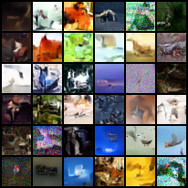
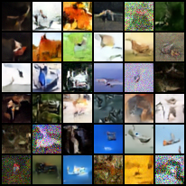

# Min-SNR DDPM Study

This repo is a thin study wrapper around [`ablation-harness`](external/ablation-harness) for:
- Comparing **Min-SNR loss reweighting** vs a **vanilla ε-prediction DDPM** baseline.
- Running tightly controlled experiments on CIFAR-10 (32×32) with shared infra.
- Tracking preregistrations, results, and plots in one place.

Core logic (models, training loop, samplers, etc.) lives in `external/ablation-harness`.  
This repo mainly provides **configs, docs, and plots** for the Min-SNR project.

---

## info for cloning and setting up the enviroment for this repo found in: reproducibility.md & enviroment.md (complicated, I aplogize)

## Samples: (FID ~70)

### baseline:

### min-snr:

