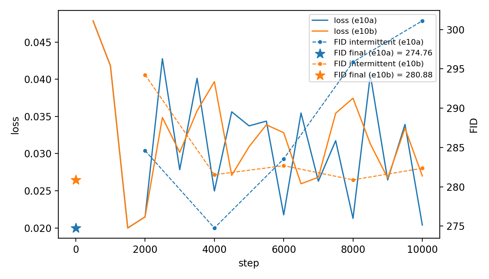
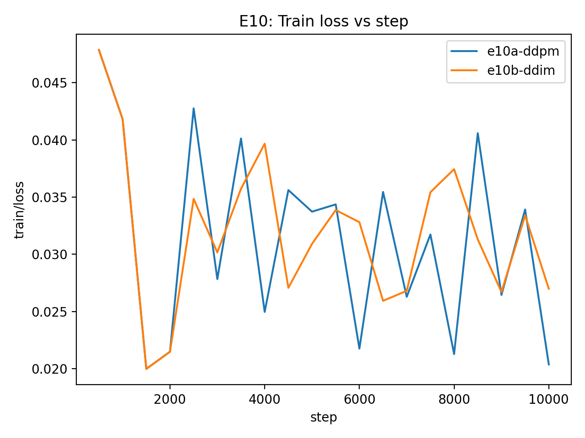
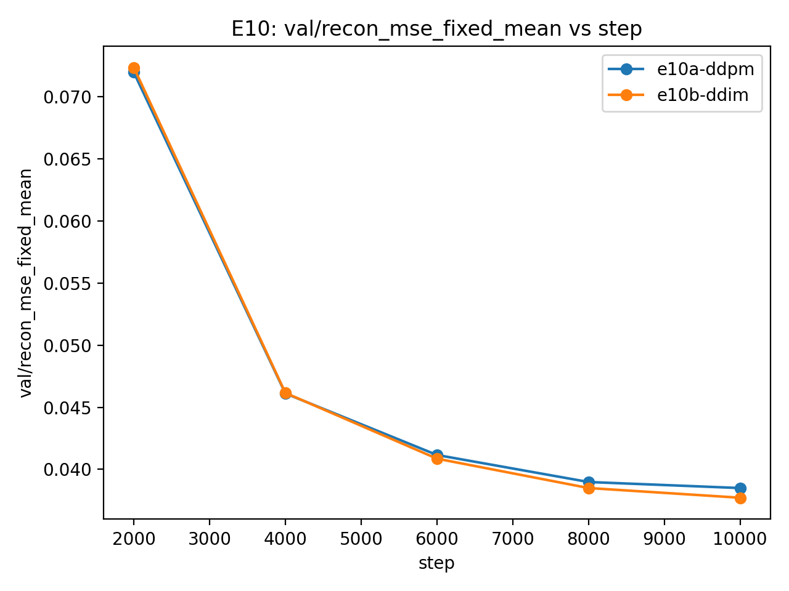
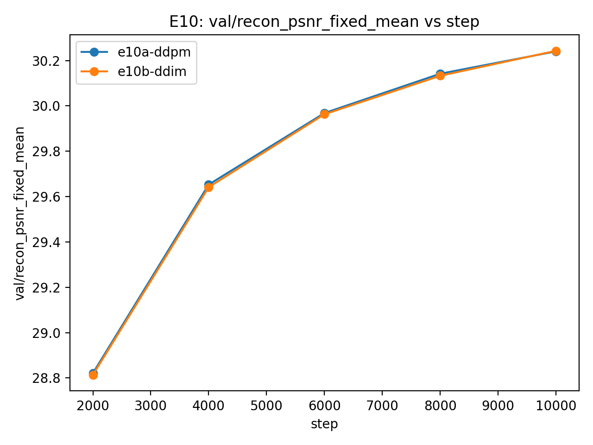

# E10 — Sampler sanity (DDPM vs DDIM @ NFE=20) + FID autopsy (10k, bc64, γ=5)

**Runs**
- **E10a:** Min-SNR (γ=5), eval sampler **DDPM**, NFE=20
- **E10b:** Min-SNR (γ=5), eval sampler **DDIM**, NFE=20  
(Other knobs matched: CIFAR-10, cosine β, UNetCifar32 base_channels=64, EMA=0.999, 10k steps, bs=4, AMP.)

## What I wanted to learn
1. **Does sampling run end-to-end without obvious bugs?**
2. **If FID is bad, is it likely real (under/overfit/capacity) vs a pipeline/sampler issue?**

## Key results
- **Final FID (10k samples):**
  - **E10a (DDPM): 274.76**
  - **E10b (DDIM): 280.88**  
  DDPM is better by ~6 FID, but both are extremely high.

- **FID vs step (milestones):**
  - No clean improvement trend. Values bounce a lot. DDPM even drifts worse late, while DDIM is flatter.

- **Train loss:**
  - Similar scale + shape across runs. A bit flaky deterministically.

- **Recon metrics (fixed t-set):**
  - Recon improves steadily with training (fixed-mean MSE down, PSNR up).
  
    #### mse
    

    #### psnr
    

  - Recon profiles vs t for DDPM/DDIM are very similar at the end.

## Interpretation:
- The model is learning something (recon improving), so training isn’t totally broken.
- But **sample quality as measured by FID is poor** and not tracking recon.
- That pattern is consistent with **a sampling/FID pipeline mismatch somewhere** (normalization, scaling, clamping/saturation, sampler coefficient bug etc), or simply too-undertrained for unconditional generation at NFE=20. but the absolute FID (~275–281) is so bad that I’ll treat pipeline/sampler issue as the first suspect for now until further proven otherwise.

## Bottom line
- **Sampling runs (no crashes, recon behaves, metrics log), but FID is not credible yet as a model-quality signal.
- With current numbers, DDPM beats DDIM at NFE=20, but both are in something is fundamentally off territory.
