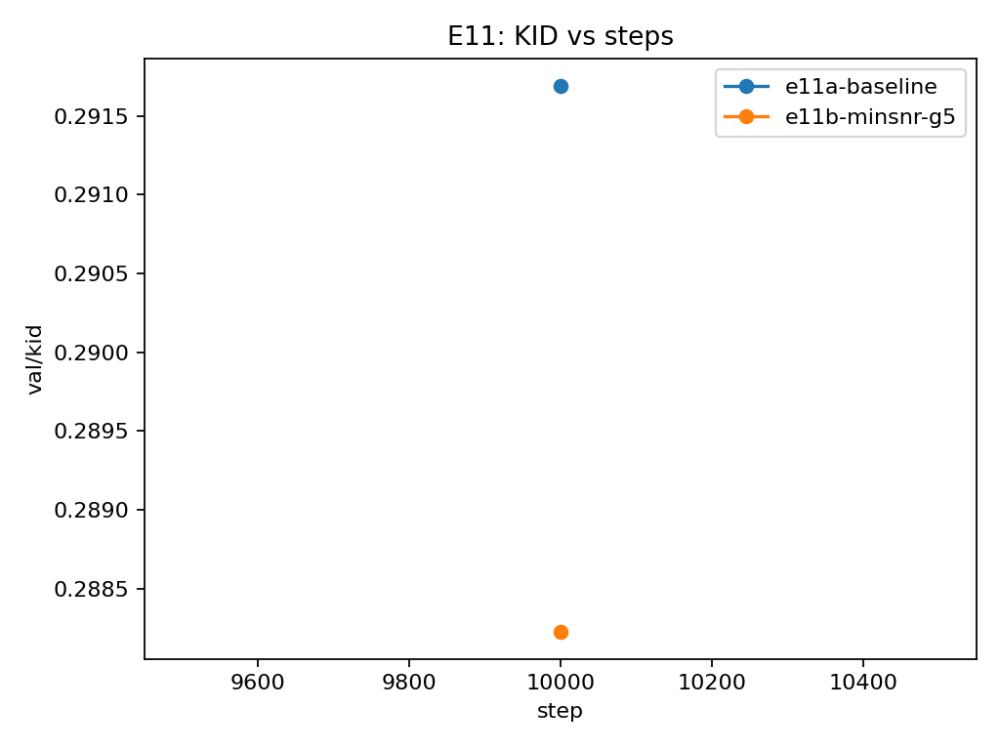
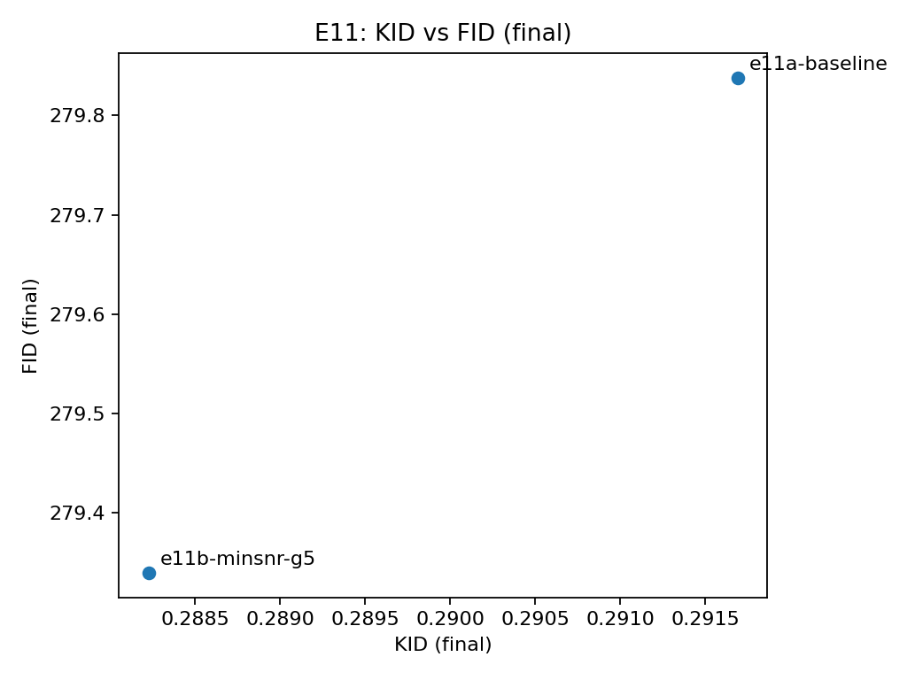
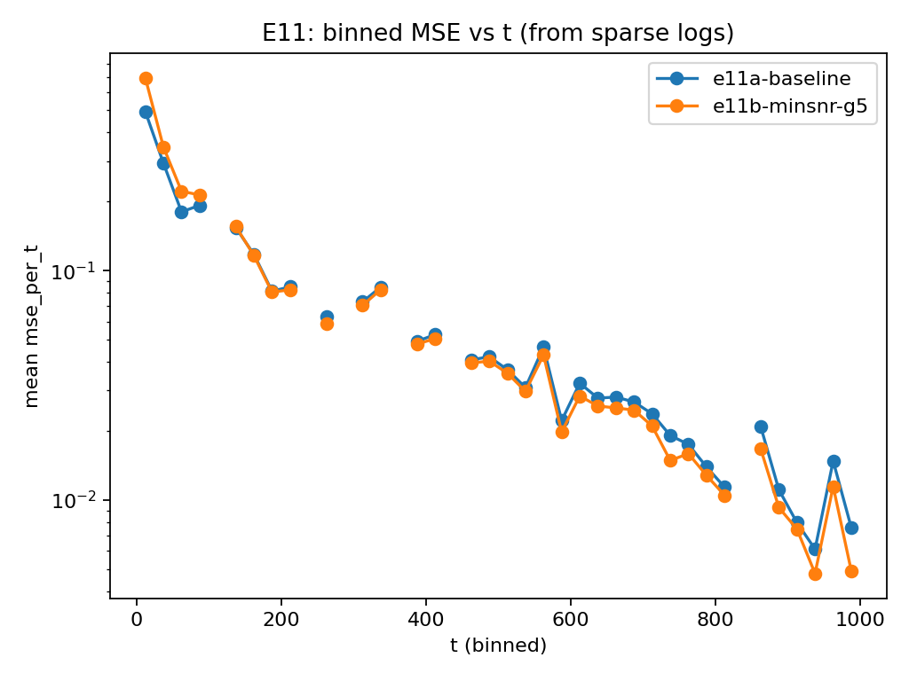

# E11 – KID sanity check (baseline vs Min-SNR, recon)

**Goal:** verify KID is implemented + logs sane values, and that it broadly tracks FID directionally. Just to ensure it works.

**Runs:**  
- **e11a-baseline** (constant weighting)  
- **e11b-minsnr-g5** (Min-SNR γ=5)

**Eval setup (recon):** DDIM, **NFE=10**, **KID pool=5k** (single checkpoint @ step 10k), FID computed at end (same sampler/NFE).

---

## Results (final @ step 10k)

| runs | KID (final) ↓ | FID (final) ↓ |
|---|---:|---:|
| e11a-baseline | 0.291691 | 279.838 |
| e11b-minsnr-g5 | 0.288225 | 279.339 |

Δ (e11b − e11a): **KID −0.003466 (~−1.19%)**, **FID −0.499 (~−0.18%)**

---

## Plots 

- **KID vs steps:** both runs log KID cleanly at the eval step; Min-SNR is lower.  

    
  

- **KID vs FID (final):** the ordering matches(Min-SNR better on both).  
    
    
    

- **Binned MSE vs t (from sparse logs):** Min-SNR shows higher error at very low t but is slightly lower through mid/late t, consistent with reweighting moves effort around timestep space rather than uniformly improving everything.  

    

---

## Takeaway
KID looks sane and usable as a cheap recon metric in this harness: it produces finite values and agrees directionally with FID in this 2-run check.

