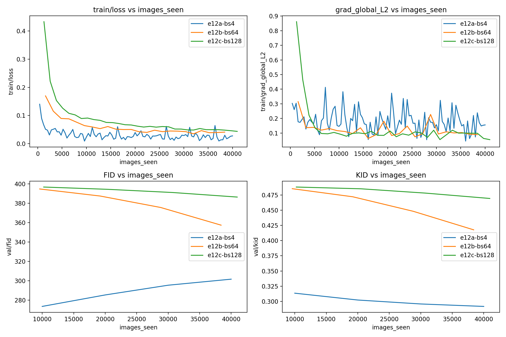
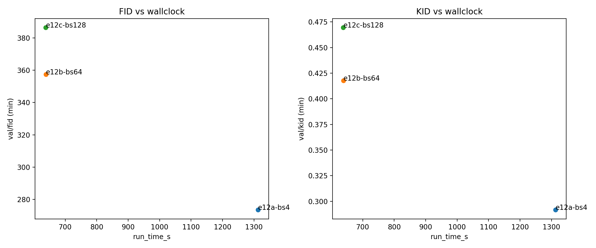
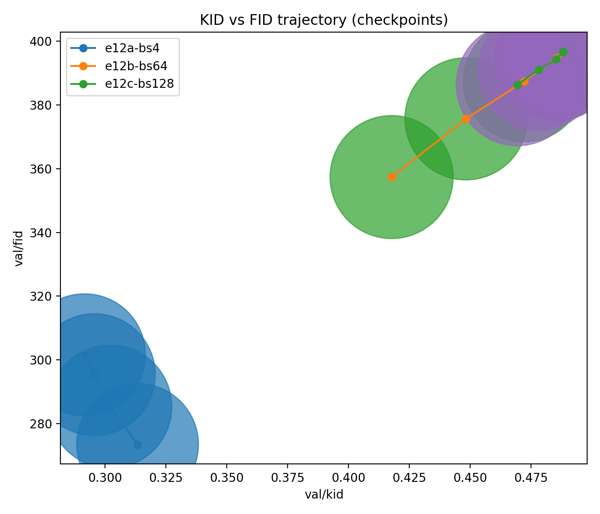

# E12 – Batch size sweep (bs4 vs bs64 vs bs128)

**ID:** E12  
**Study:** min-snr (ablation-harness)  
**Question:** Under a fixed *images_seen* budget, how do batch sizes {4, 64, 128} trade off (a) training dynamics, (b) sample quality (FID/KID), and (c) wall-clock efficiency?

**Runs:**
- **E12a:** `e12a-bs4`
- **E12b:** `e12b-bs64`
- **E12c:** `e12c-bs128`

**Primary metric:** val/FID (lower is better)  
**Secondary:** val/KID (lower), wall-clock (run_time_s), train/loss, train/grad_global_L2

---

## Design 

- **Data:** CIFAR-10.
- **Model:** `unet_cifar32` (same architecture across runs).
- **Diffusion / sampler:** unchanged across runs (only batch size varies).
- **Budget framing:** comparisons are made vs **images_seen** (fair compute-by-data) and vs **run_time_s** (fair compute-by-time).

## Results

### 1) Training dynamics (vs images_seen)

**Loss**
- **bs4** converges fastest and to the lowest train/loss.
- **bs64** and **bs128** start higher and remain above bs4 across the run.

**Gradient global L2**
- **bs4** has noticeably higher variance (expected for small batches).
- **bs64/bs128** are smoother but do *not* translate that smoothness into better final quality.

**Takeaway:** larger batch reduces gradient noise, but in this setup it does not improve convergence to better generative quality.

---

### 2) Sample quality (FID/KID vs images_seen)

**FID**
- **bs4** is best at every checkpoint and ends substantially lower than the others.
- **bs64** improves meaningfully but remains far above bs4.
- **bs128** improves the least and stays worst.

**KID**
- Same ranking as FID: **bs4** best, **bs64** second, **bs128** worst.
- Rankings are consistent across checkpoints.

**Takeaway:** quality ordering is stable:  
**bs4  ≫  bs64  ≫  bs128**.

---

### 3) KID–FID trajectory (checkpoints)

- **bs4** occupies a distinctly better region of the KID–FID plane.
- **bs64** moves along a reasonable improvement path but never approaches bs4.
- **bs128** trajectory is shallow (little movement / limited improvement).

**Takeaway:** bs4 is not just “faster improvement” — it reaches a better quality region within this budget.

---

### 4) Wall-clock efficiency (Pareto)

Observed total runtime:
- **bs4:** ~1313s  
- **bs64:** ~638s  
- **bs128:** ~638s  

**FID vs wall-clock**
- **bs4** is best FID but ~2× slower.
- **bs64** gives a large speedup with moderate quality loss.
- **bs128** is **strictly dominated** by bs64 (worse FID at identical time).

**KID vs wall-clock**
- Same Pareto ordering; **bs64 dominates bs128**.

**Takeaway:**  
- **Best quality:** bs4  
- **Best speed–quality tradeoff (Pareto):** **bs64**  
- **Not recommended:** bs128 (dominated)

---

### 5) Runtime breakdown (train vs eval vs other)

- **bs4:** eval ~41% of runtime
- **bs64 / bs128:** eval ~83% of runtime

Interpretation:
- For bs64/bs128, evaluation dominates wall-clock, so increasing batch size does not reduce total runtime meaningfully.
- This explains why bs64 and bs128 tie on time, yet bs128 is worse on quality.

**Takeaway:** evaluation cadence/cost is the bottleneck at larger batch sizes in this regime.

---

## Conclusions

1. **bs4** is the clear quality winner (best FID/KID), at ~2× wall-clock.
2. **bs64** is the best default for sweeps: near-minimum runtime with substantially better quality than bs128.
3. **bs128** is dominated and should be avoided unless strategy changes.

---

- Use **bs64** for upcoming sweeps by default.
- Use **bs4** only for quality-first confirmation runs.

