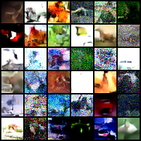
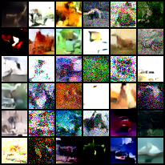
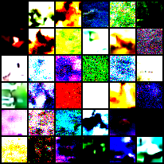
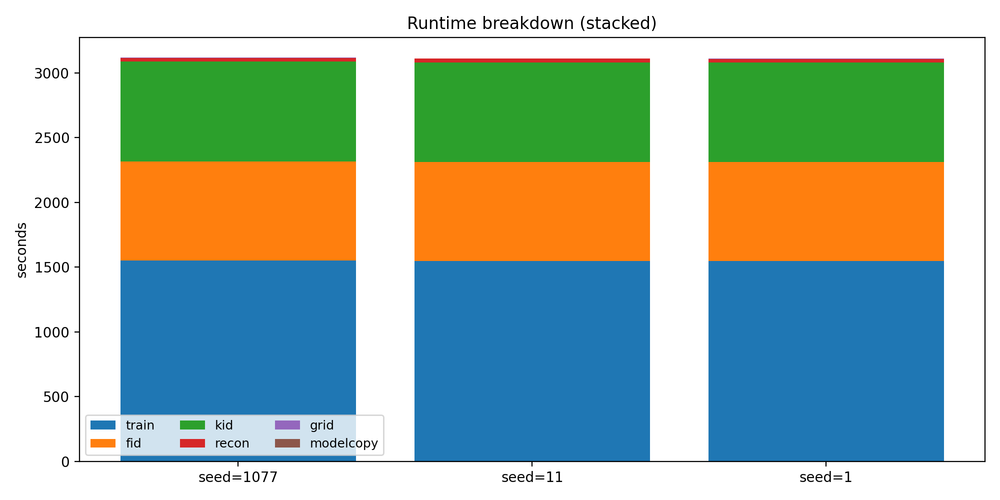
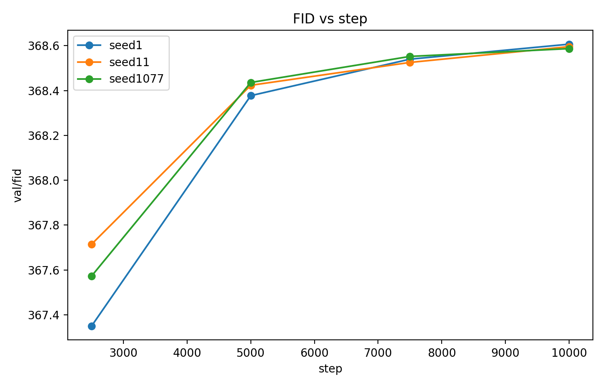
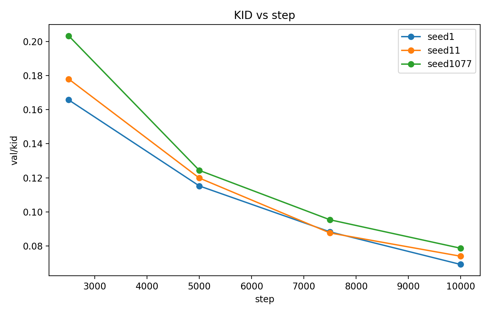

# E13 — Seed sensitivity (baseline linear, 10k steps, NFE=50)

## Visual sanity (sample grids)
- All three seeds (1 / 11 / 1077) look **qualitatively the same** at 10k: mostly high-freq speckle/noise with weak CIFAR-like structure.
- No seed shows a distinct failure mode (no obvious collapse/outlier).
- These are by FAR the qualitatively best runs so far.

#### seed 1:

#### seed 11:

#### seed 1077:

#### e7c: seed 1077 (bs 4, all other config =, @40 mins (~1.2x faster) wallclock):

Batch size makes an enormus difference.

## Metric stability (seed variance)
- Seed-to-seed spread is tiny at every milestone, and extremely tiny at 10k.
- Interpretation: for this config/regime, 1 seed is fine for fast iteration; reserve 3-seed for confirmatory runs.

## Eval cost: what’s eating runtime?
From `results.jsonl` totals:
- **Training:** ~49.7% of runtime
- **Evaluation:** ~50.3% of runtime

Inside evaluation:
- **FID:** ~24.6% of total runtime
- **KID:** ~24.6% of total runtime
- Recon/grid/modelcopy are negligible (~1–2% combined)

Per eval point (avg):
- ~191s FID + ~187s KID ≈ **~6.3 min** each milestone
- 4 milestones ⇒ **~25–26 min eval** per run

## Are the metrics worth it right now?
- Cost-wise: **KID is not cheaper than FID** (basically equal wall time).
- Signal-wise: in E13, KID improves strongly while FID slightly worsens, so they do not track each other in this regime.

- Outcome: keep FID as primary, and do not use KID gating until correlation is verified on a regime where samples improve (or implementations are cross-checked). Increase grids/recon/etc.

