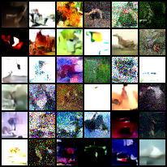

# Results: E14 — Seed sensitivity (min-SNR, linear, NFE=50)

Ran 3 seeds (1, 11, 1077) with eval every 2.5k steps to measure seed-to-seed variance under the min-SNR config.

## Endpoints @ 10k (n=3)
- FID (DDPM, NFE=50): mean 368.695, sd 0.016, range 0.030
- KID (DDIM, NFE=50): mean 0.0499, sd 0.00255, range 0.00455

Seed-to-seed spread at 10k is extremely very small under this setup.

## Trend over training
- KID decreases strongly from ~0.17 @2.5k to ~0.05 @10k.
- FID is lowest at 2.5k (~367.7 mean) and slowly increases to ~368.7 by 10k.

## Qualitative

#### Seed 1 (min-snr):

Sample grids at 10k are still largely noisy/unstructured.

#### Seed 1 (constant):

Baseline grid (seed1) looks similarly, suggesting I'm  not yet in a well learned regime at 10k. 
BUT: min-snr does show perhaps a bit less high frequency speckle.

Will test for sampling progression in lower nfe upcoming sweeps.

## Mse per T:
- min-snr downweighting of lower timesteps successfully compared to constant weighting (consistent through all seeds).

## Runtime
~53 min/run; eval is ~50% of wall-clock. FID and KID dominate eval time.

