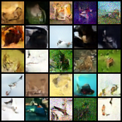

# Results: E18 — Seed sensitivity (min-snr, cosine β, NFE=25)

## Prereg (intent)
- Question: how much do random seeds change results under cosine + min-snr?
- Seeds: `[1077, 11, 1]`
- Train: 10k steps, batch 64, EMA=0.999, AMP on, grad_clip=1.0
- Eval (key):
  - **KID:** every 2500 steps, **DDIM**, NFE=25 (n_samples=5000, repeats=20)
  - **FID milestone:** every 2500 steps, **DDPM**, NFE=25 (n_samples=5000)
  - **Grid:** every 1000 + at 10k, DDIM, NFE=25 (36 samples)
  - **Recon:** every 2000 (MSE/PSNR sanity)

## Core metrics (per-seed)
(Reported at step **2500 / 5000 / 7500 / 10000**; table shows endpoints at **2500** and **10000**.)

| seed | FID@2500 | KID@2500 | FID@10000 | KID@10000 |
|---:|---:|---:|---:|---:|
| 1    | 316.15 | 0.3715 | 340.93 | 0.2942 |
| 11   | 296.84 | 0.3372 | 344.32 | 0.2985 |
| 1077 | 314.21 | 0.3771 | 339.73 | 0.2901 |

## Seed spread (mean ± sample std, n=3)
| step | FID (mean ± std) | KID (mean ± std) |
|---:|---:|---:|
| 2,500  | 309.07 ± 10.64 | 0.3619 ± 0.0216 |
| 5,000  | 325.21 ± 0.08  | 0.3123 ± 0.0049 |
| 7,500  | 335.97 ± 2.55  | 0.3032 ± 0.0021 |
| 10,000 | 341.66 ± 2.38  | 0.2942 ± 0.0042 |

## Trend / takeaway
- **FID worsens with training after 2.5k** (for all seeds).
- **KID improves steadily** with training (for all seeds).
- Seed spread is largest early (2.5k) and becomes small/stable later.

## Runtime (per seed)
| seed | wall (min) | eval (min) | eval % |
|---:|---:|---:|---:|
| 1    | 28.52 | 9.71 | 34.13% |
| 11   | 28.30 | 9.68 | 34.28% |
| 1077 | 28.54 | 9.85 | 34.92% |

## Comparison vs E17 baseline (constant weighting, same schedule/eval)
(Δ = E18 − E17; negative KID is better, negative FID is better.)

| step | ΔFID (E18−E17) | ΔKID (E18−E17) |
|---:|---:|---:|
| 2,500  | +20.12 | +0.0342 |
| 5,000  | +11.36 | -0.0023 |
| 7,500  | +12.34 | -0.0026 |
| 10,000 | +13.32 | -0.0044 |

**Read:** under this exact setup, min-snr worsened FID vs baseline at all milestones, while slightly improving KID at later milestones (but worse early). Last part might have something to do with timestep reweighting?

## Samples comparasion:

### e17 (baseline, seed 1):

### e18 (min-snr, seed 1):

Very difficult to tell the difference (min-snr perhaps slightly less saturated/cohernent?).
