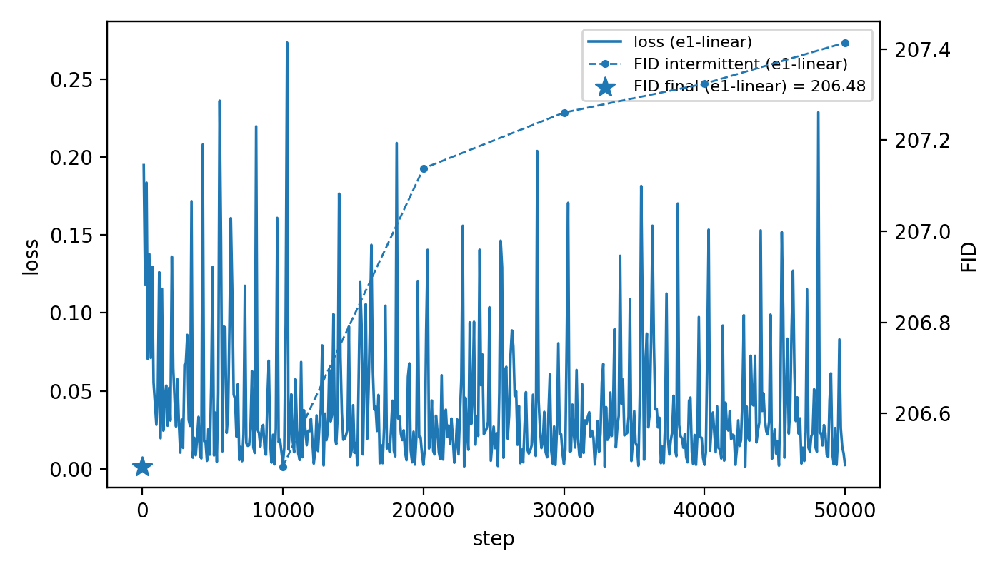
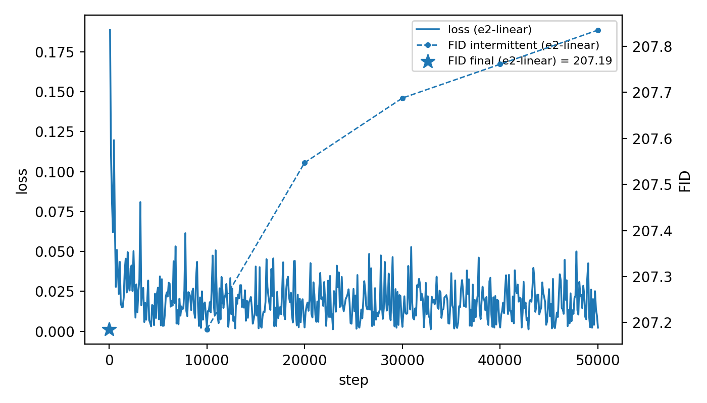
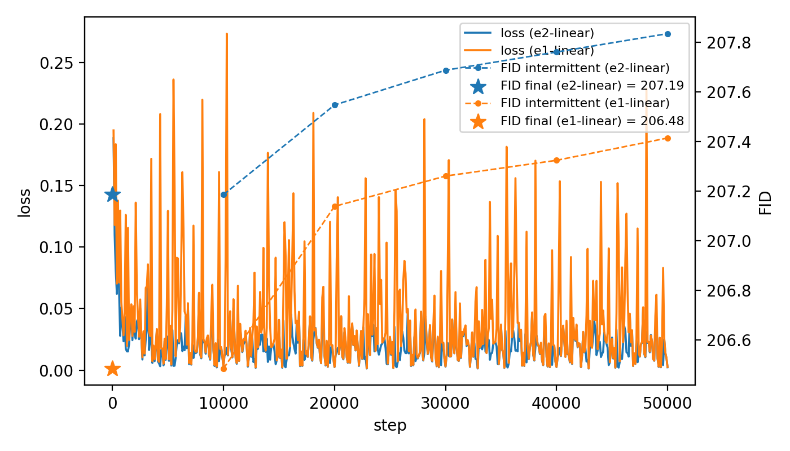

# E2 – Results: Min-SNR gamma 5 DDPM, linear β, 50k steps (CIFAR-10 32×32)

## Summary

- **Config:** `configs/study/MS1_min_snr/e1/e1_baseline_linear.yaml`
- **Idea:** Compare against DDPM linear baseline. 
- **Outcome (short):**
  - Final FID@10k (NFE=50): **206.48**
  - Training completed all 50k steps: Yes.
  - Any notable behavior (e.g. early plateaus, instability): Loss started and was significantly lower. Higher FID, noticable trend to rise over time again like DDPM baseline. Fid is worse than DDPM run's: 207.18 vs 206.48.

---

### Final metrics

| Metric                         | Value      | Notes                    |
|--------------------------------|------------|--------------------------|
| FID@10k (NFE=50, final eval)   | 207.18   | From `results.jsonl`     |
| Best FID@10k (if different)    | 207.18  | From `results.jsonl`               |
| Final train loss               | 0.002  | From `loss.jsonl`        |

### Training dynamics (qualitative)

- **e1 plot:**
    - 

- **e2 plot:**
    - 

- **overlay:**
    -   

- Loss curve shape: Significantly lower spikes, not unstable
- Spikes from batch 4 (like DDPM).
- Intermittent FID milestones: ~207, appear to consistently worsen over time if same sample size is used in eval, noticed in e1 as well. 

## Samples

- **e1 final:**
    [alt text](../../assets/e1/min-snr-e1/runs/min_snr/min_snr__unet_cifar32__cifar10__adam__lr1e-04__ema1__seed=1077/eval/step_050000/grid/grid.png)
  
- **e2 final:**
    

  - Quick impression of image quality: very similar to e1. Saturated colour blobs. FID does not surprise me.

