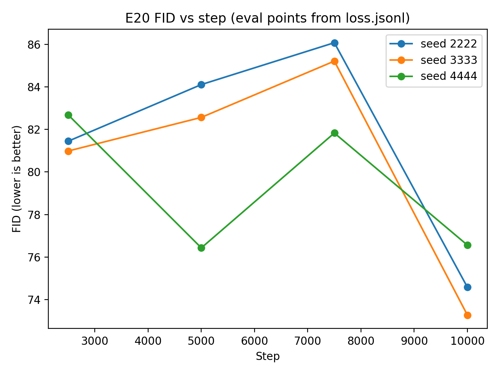
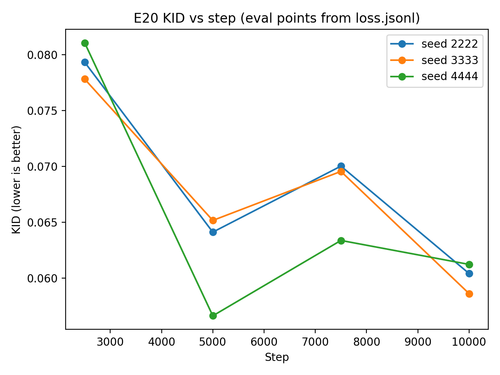
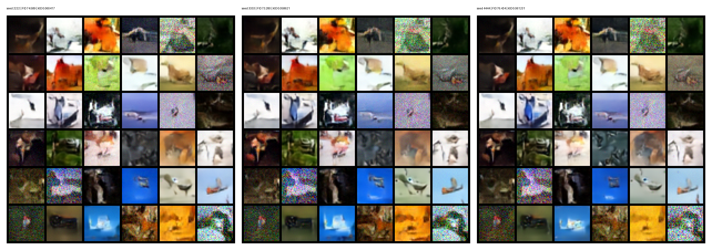

# E20 Results — Hold-out baseline (Min-SNR, cosine)

**ID:** E20  
**Purpose:** Lock a clean, 3-seed hold-out reference point for the current best Min-SNR config.

## Config
- Dataset: CIFAR-10 (full), batch size 64, workers 2
- Model: `unet_cifar32` (params: 5,550,403)
- Diffusion: cosine β schedule
- Loss: Min-SNR weighting
- Optim: Adam, LR=1e-4
- Train: 10,000 steps, AMP on, grad clip 1.0
- EMA: decay 0.999
- Seeds (hold-out): [2222, 3333, 4444]
- Git: `9837c9b9bf85c70cde943beaa10f482c202f5408`

## Primary endpoint @ step 10,000 (n=3)
- **FID:** 74.77 ± 1.58  (min 73.28, max 76.43)
- **KID:** 0.06009 ± 0.00134  (min 0.05862, max 0.06123)

### Per-seed @ 10k
| seed | FID | KID |
|---:|---:|---:|
| 2222 | 74.589 | 0.060417 |
| 3333 | 73.280 | 0.058621 |
| 4444 | 76.434 | 0.061231 |

## Runtime  (n=3)
- **Total:** 27.1 ± 0.3 min  (min 26.9, max 27.5)
- **Eval share:** 30.67% ± 0.32%

### Eval time breakdown (mean ± std, in seconds)
- fid: 242.4 ± 0.5
- grid: 3.5 ± 0.0
- kid: 234.0 ± 11.1
- modelcopy: 1.5 ± 0.0
- recon: 17.7 ± 0.1

## Curves:

Eval checkpoints in all 3 runs: **[2500, 5000, 7500, 10000]**.

### Mean ± std across seeds
| step | FID (mean ± std) | KID (mean ± std) |
|---:|---:|---:|
| 2500 | 81.71 ± 0.87 | 0.07941 ± 0.00162 |
| 5000 | 81.04 ± 4.06 | 0.06197 ± 0.00466 |
| 7500 | 84.37 ± 2.24 | 0.06765 ± 0.00371 |
| 10000 | 74.81 ± 1.65 | 0.06009 ± 0.00134 |

## FID & KID vs step:

## Result:

- Min-snr shows consistently lower and more stable end FID than the constant weighted baseline.
- Kid and FID correlate but not exact. 

### Samples:

