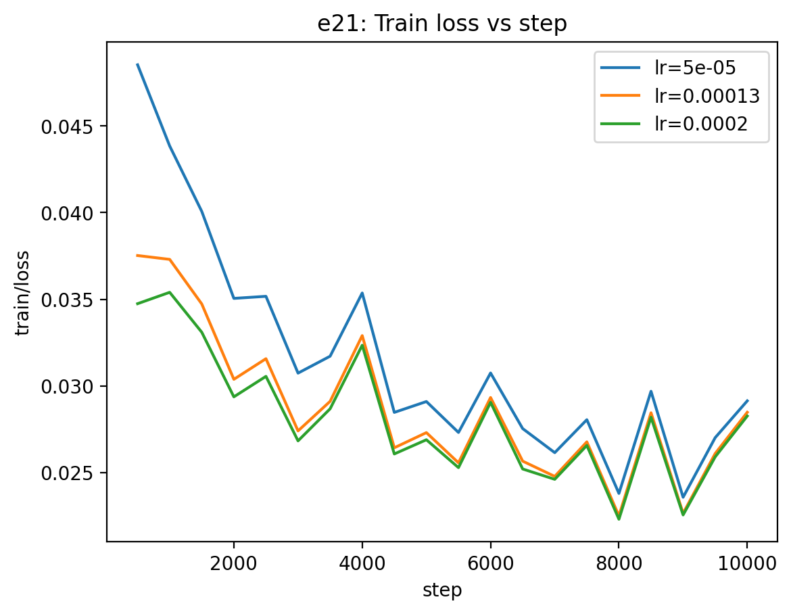
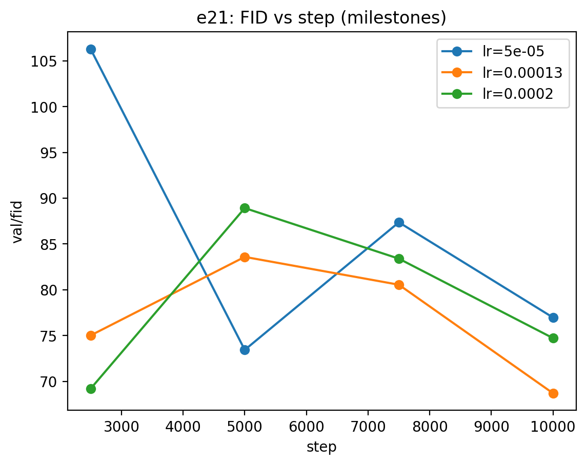
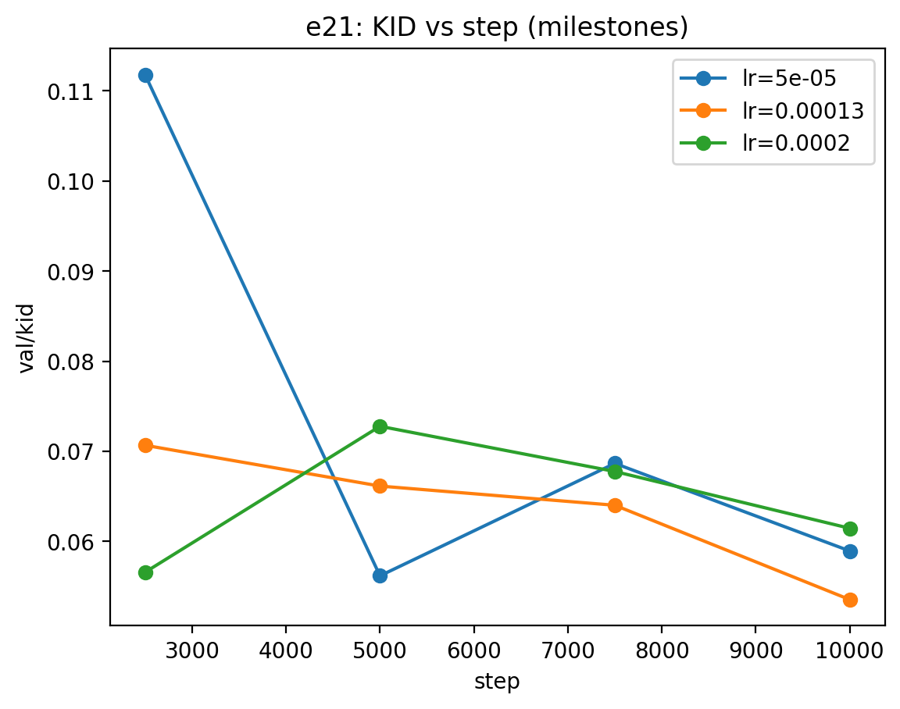
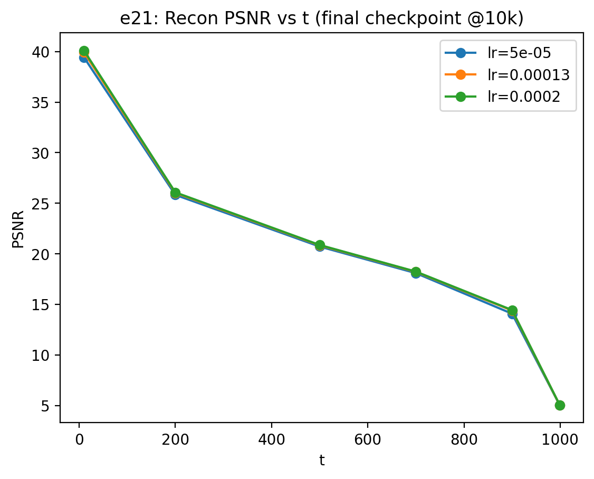
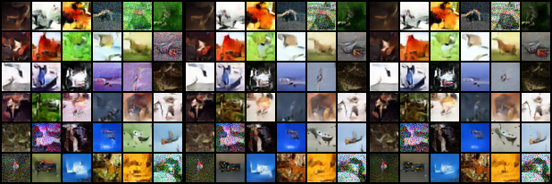

# e21 — LR sensitivity probe (Min-SNR)

**Purpose.** Tiny hyperparam sensitivity check: does **learning rate** materially affect Min‑SNR performance under an otherwise fixed setup?

**Decision rule (per prereg).** Treat an LR as meaningfully better if it improves **FID at 10k steps** by **≥ 1.0** versus alternative.

---

## Setup:

- Dataset: **CIFAR‑10**
- Model: `unet_cifar32`, base_channels=64
- Diffusion: **cosine β schedule**
- Loss: **Min‑SNR weighting**, γ=5.0
- Optim: Adam, **LR sweep**
- Train: 10,000 steps, batch=64, AMP on, grad clip=1.0
- Seed: **11**
- Eval:
  - **FID/KID milestones** every 2,500 steps (samples=5,000)
  - **Grid** every 1,000 steps (DDIM, NFE=20)
  - **Recon** every 2,000 steps (fixed t points)

---

## Results

## loss (semi consistent with FID winner):

### Milestone metrics (FID ↓, KID ↓)

| LR | FID @2.5k | FID @5k | FID @7.5k | **FID @10k** | KID @10k |
|---:|---:|---:|---:|---:|---:|
| 5e-5 | 106.28 | 73.43 | 87.37 | 76.97 | 0.05894 |
| **1.3e-4** | 75.01 | 83.59 | 80.55 | **68.70** | **0.05354** |
| 2e-4 | **69.19** | 88.92 | 83.40 | 74.72 | 0.06145 |

**Winner @10k:** LR = 1.3e‑4 (FID **68.70**, KID **0.05354**)

## Fid:

## Kid (follows curve):

**Effect size (FID @10k):**
- 1.3e‑4 beats 2e‑4 by **6.02** FID
- 1.3e‑4 beats 5e‑5 by **8.27** FID

This clears the prereg threshold (≥1.0 FID), so LR sensitivity is real. Would have been nice to tackle earlier.

## recon: mostly the same

Slightly less divergant over harder timesteps, discountable by noise.

---

## interpretation

- **Non‑monotonic behavior:** 2e‑4 (and 5e‑5) reach their best FID earlier and then degrade by 10k.  
- lr was worth a small experiemnt after all!

## Grids:

(left to right: 5e-5, 1.3e-4, 2e‑4) Grids of 5e-5 noticably less refined, consistent with higher FID; others can't tell.
