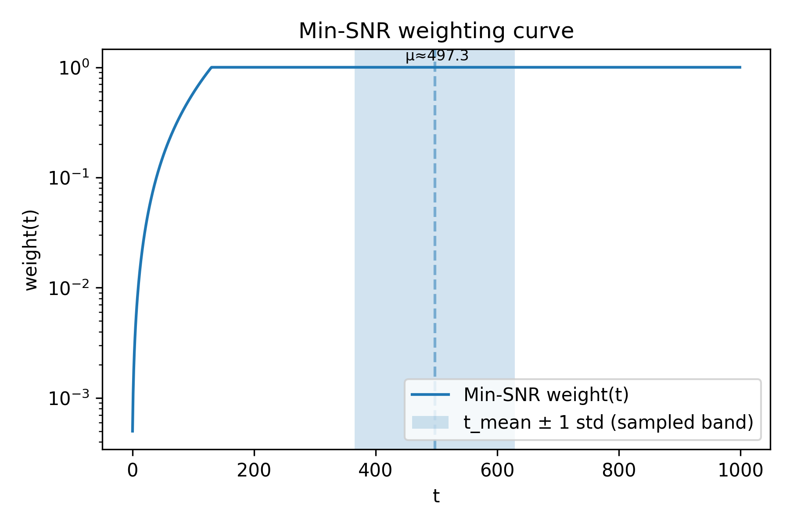
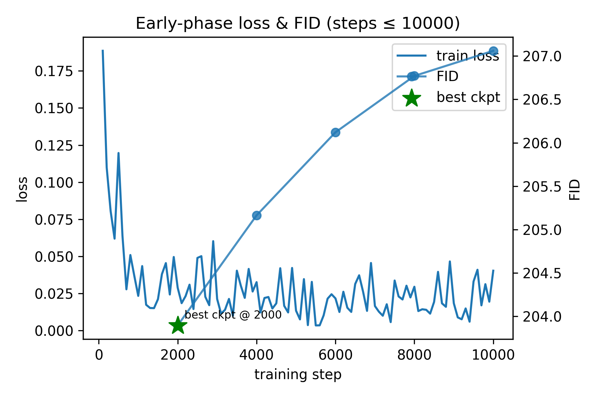
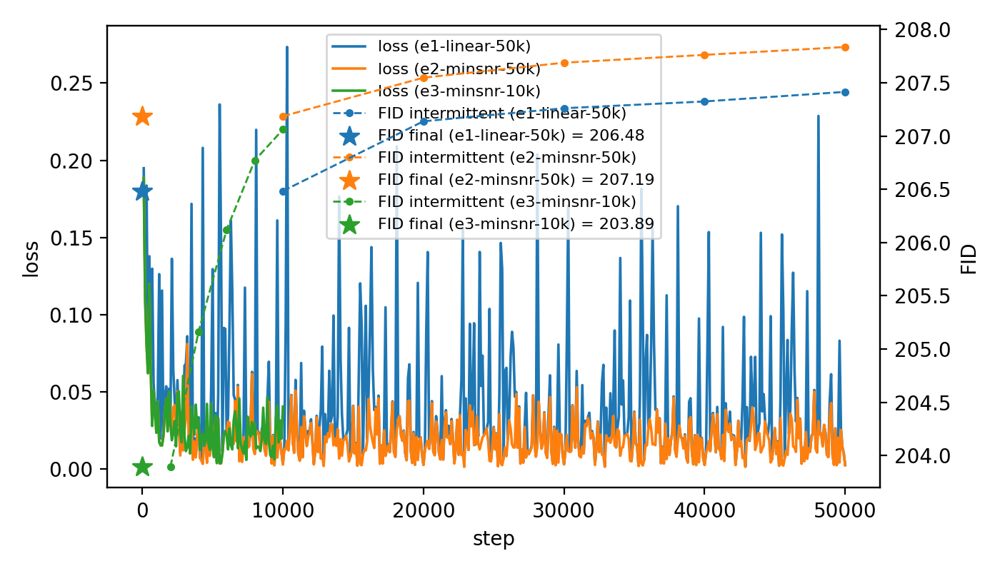
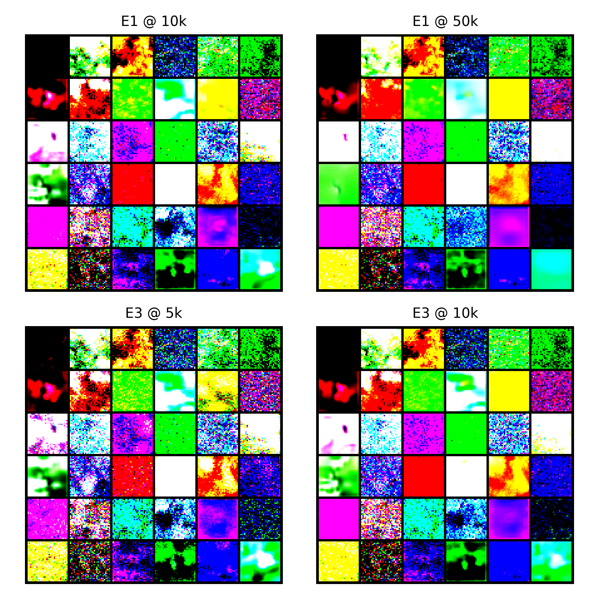

# E3 – Results: Min-SNR gamma 5 DDPM, linear β, 10k steps (CIFAR-10 32×32)

## Summary

- **Config:** `configs/study/MS1_min_snr/e3/e3_minsnr_linear.yaml`
- **Idea:** Compare against e2 for observed effect with smaller run. 
- **Outcome (short):**
  - Final FID@10k (NFE=50): **203.89**
  - Training completed all 10k steps: Yes.
  - Any notable behavior (e.g. early plateaus, instability): Looks like a miniture e2, loss even aligns. Clear FID worsening like others.

---

## Min-SNR stats:

The first timesteps are downweighted, the rest are default DDPM.
Not quite sure how to interpret these stats yet. But very interesting.

## Loss & training:
- No collapse, low(er) spikes than e1 and conforms largely to e2's training curve. 

- Compared to other experiements: its FID increases proportionally to where e3's ends, suggesting a continuation of that trajectory is consistent with this config. 

## FID quirks:

All runs: FID drifts upward as training proceeds.

Best FID occurs early (E3 at 2k, E1/E2 near 10k). 

# Samples:
Similar to e2, perhaps noticably noisier. 

E1 compared to e3:

