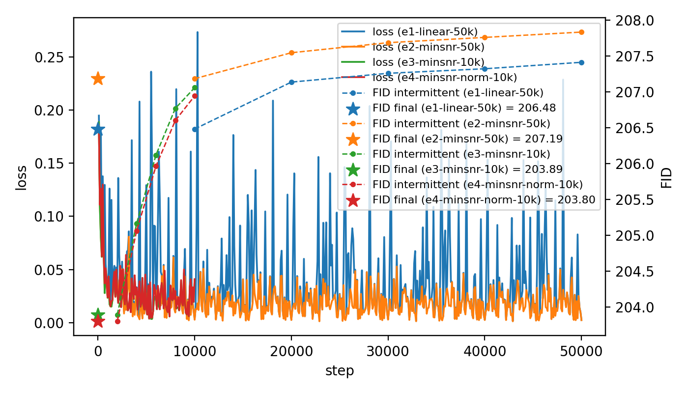
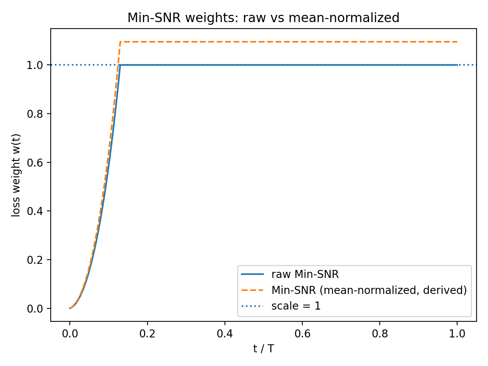
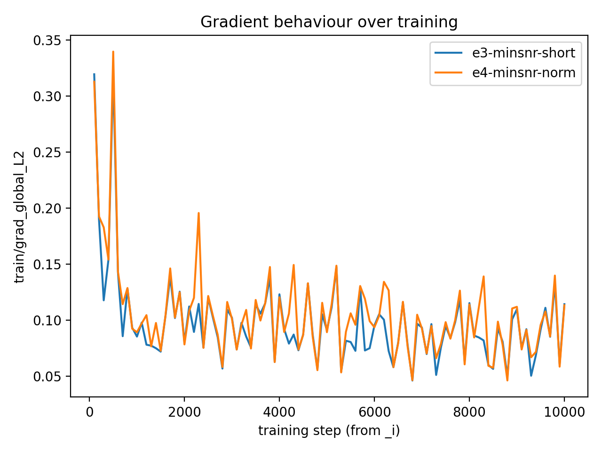
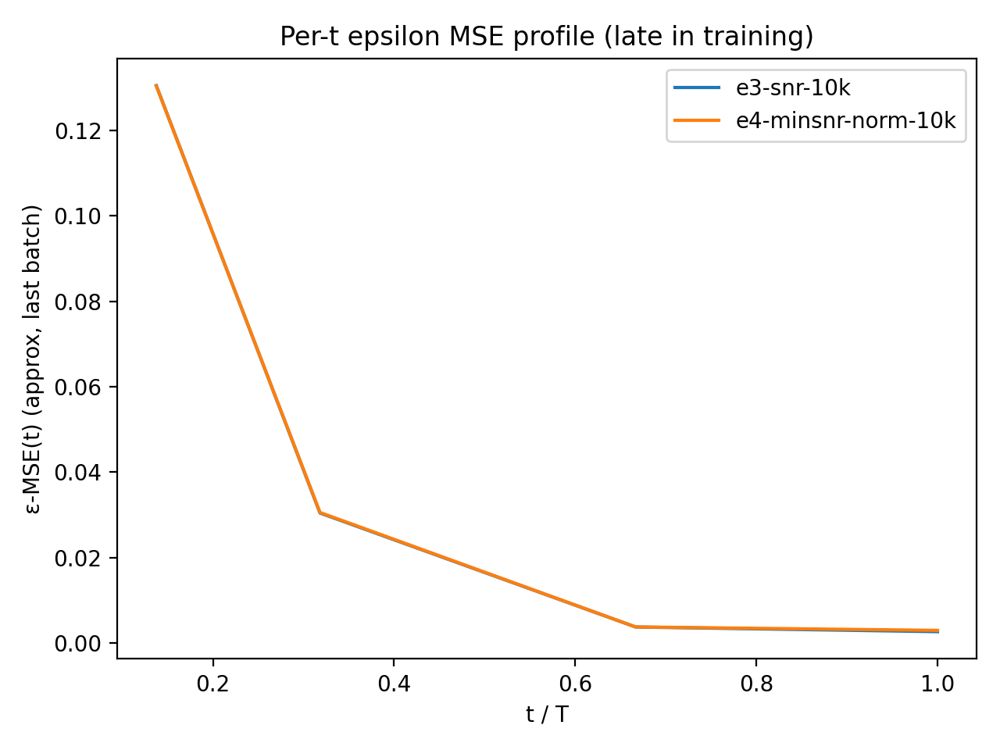

## W1-E4 – Min-SNR mean-normalized weights (shape vs scale)

### Setup

- **Goal:** Separate the effect of Min-SNR’s shape over timesteps from its overall scale.
- **Change vs W1-E2:**
  - Loss weighting: `minsnr_norm` instead of `minsnr`.
  - `w_raw(t)` matches E2’s Min-SNR-γ weights.
  - `w_norm(t) = w_raw(t) / E_t[w_raw(t)]`, so the mean weight is ≈ 1.
- **Everything else identical to E1/E2/E3:**
  - Model, optimizer, β schedule (linear), data, EMA, sampler (DDIM, NFE=50), eval protocol.

---

### Results: FID vs steps

- ### e4 alone:
  

- **Behaviour:**
  - e2 vs e1: Loss much less spiky, FID better in starting @ 206.48 vs 203.80.
  - e4 vs e2: e2 tracks e4's curve, with min-snr vs min-snr normed. Same for e3.
- **Efficiency:** Roughly the same curve as e3. FID best at beginning ckpts.

- Mean-normalizing the Min-SNR weights preserves most of the effect and curve, suggesting that shape (or just scale) is doing the heavy lifting.

---

### Diagnostics I – Weight shape vs scale

  - E2 and E4 have identical shape over t.

- Raw Min-SNR increases the average weight by ~1.1×, effectively boosting the LR on its focus region; the mean-normalized version keeps the same focus but removes this global scaling.

---

### Diagnostics II – Gradient behaviour

- The LR survived and did not explode. 
- Norm differences look more like noise than effect between e4 and e3. e4's maybe a tad lower on average. 

- Raw Min-SNR does not appear to inflate gradient norms; compared to normed their difference is most visible with e4 being slightly higher in the early phase, but converges quickly within the first 1000 steps and appears discountable by noise.

---

### Diagnostics III – Per-t error profiles

Between normed and raw snr: epsilon per t is nearly identical, showing the same effect despite normalization. 

- There's downweighting of early 25% of timesteps and harder weighting on the last 70%. 

---

### Takeaway?

  > At this compute / model scale, Min-SNR (raw or normalized) doesn’t move FID much or have much real effect. The diagnostics show that we are undertrained overall; for now, Min-SNR is better treated as a knob to study gradient allocation rather than a reliable performance booster.

