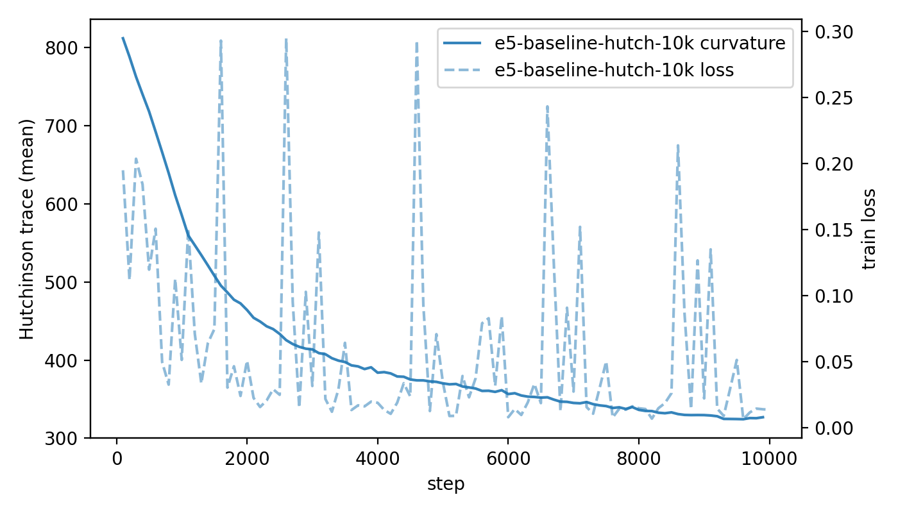
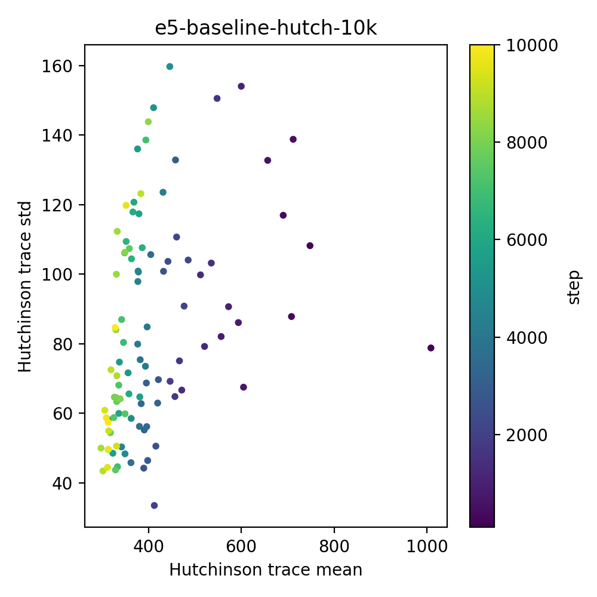
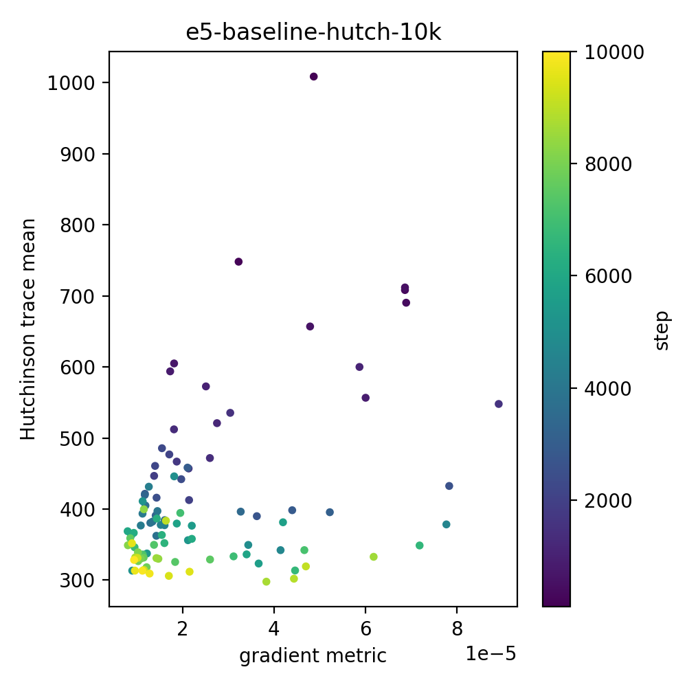
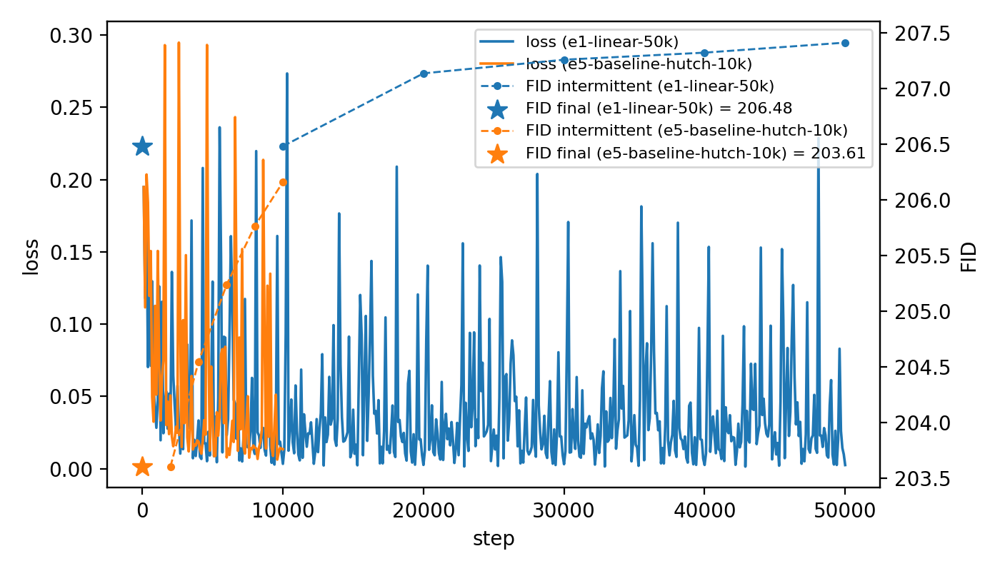

# W1 – E5: Hutchinson trace probe (baseline)

**Config:** `configs/study/MS1_min_snr/e5/e5_baseline_hutch_trace.yaml`  
**Run name:** `e5-baseline-hutch-10k`  
**Steps:** 10k  
**FID (final, NFE=50):** ~203.6 (vs E1 ~206.5)  
**Params:** ~2.0M  
**Goal:** Add a cheap-ish curvature probe (Hutchinson trace of the loss Hessian) to the vanilla DDPM baseline and see how it behaves over training.

---

## Recap & framing

- E5 reuses the **E1 baseline** setup (linear β, ε-MSE loss, same U-Net, same CIFAR-10 data) but:
  - Trains for **10k steps** instead of 50k.
  - Adds a **Hutchinson trace estimator** every N steps:
    - 16 Rademacher probes per measurement.
    - Logs `curvature/hutch_trace_mean` and `curvature/hutch_trace_std`.
- This run is mostly about **instrumentation**, like e4:
  - Does the trace estimator run stably?
  - Does it produce a structured, interpretable time-series?
  - Does it destroy FID?

---

## Curvature vs training step

**What the plot shows**

- Solid line: `curvature/hutch_trace_mean` (Hutchinson trace estimate) vs step, smoothed.
- Dashed line (right axis): `train/loss` over the same steps.

**Observations**

- **Sharp → flat transition.**  
  The curvature starts high (≈ 800-ish trace units on the first probe) and drops quickly in the first couple thousand steps to the mid–300s, then slowly drifts down and plateaus.
- **Most of the flattening happens early.**  
  Roughly half the curvature is shed in the first 1–2k steps; after ~4k steps the curve is much flatter, with only gentle decay out to 10k.
- **Loss vs curvature.**
  - Loss shows its usual noisy spikes, but the envelope of the loss aligns with the big curvature drop: as the model exits the initial high-loss regime, the trace falls sharply.
  - Later in training, loss continues to jitter around small values while curvature moves much more slowly, suggesting the model is mostly shuffling around inside a relatively flat basin.

**Takeaway:**  
For this tiny DDPM, most of the curvature story is an early phenomenon: stochastic gradient descent quickly moves from a high-curvature, unstable region into a noticeably flatter one, and then just wiggles inside it.

---

## Shape of the estimator: mean vs std

**Plot shows:**

- Each point is **one curvature measurement**:
  - X: `curvature/hutch_trace_mean`.
  - Y: `curvature/hutch_trace_std`.
  - Color: training step (dark = early, bright = late).

**Observations**

- **Early steps:**  
  - High mean trace (500–1000).  
  - High std (up to ~150–160).  
  - Coefficient of variation is large (estimates are pretty noisy).
- **Late steps:**  
  - Points cluster around lower mean curvature (≈ 300–380).  
  - Std drops into the ~40–80 band.  
  - Relative noise is smaller; the estimator maybe stabilizes as the model moves into flatter regions.

**Takeaway:**  
Hutchinson is noisy, but not degenerate: as the optimiser finds a flatter basin, both the level of curvature and the variance of the estimator drop. Late in training a reasonably stable trace signal emerges for this model with just 16 probes.

---

## Curvature vs gradient scale

**Plot shows:**

- X: a gradient magnitude metric (`train/grad_abs_mean` in this run).  
- Y: `curvature/hutch_trace_mean`.  
- Color: step.

**Observations**

- **Early phase:**  
  - Larger gradients tend to coincide with larger curvature; the top-right of the cloud is mostly early (dark) points.
- **Late phase:**  
  - As training progresses, both gradient magnitude and curvature shrink and points drift toward the bottom-left.
  - There’s a kind of floor: curvature stops collapsing much further even as gradients get very small, suggesting the model settles into a basin with some residual average curvature instead of a perfectly flat valley.

**Takeaway:**  
Curvature and gradient scale are correlated early in training, but decouple somewhat once the optimiser enters its flat-ish basin. The Hutchinson trace is picking up more than just overall gradient size; it has its own geometry story.

---

## FID & sample quality (vs E1 baseline)

**Quantitative**

- **E1 (baseline, 50k steps):**
  - Final FID ≈ **206.5**.
- **E5 (baseline + curvature, 10k steps):**
  - Final FID ≈ **203.6**.
- Intermittent FIDs are all in the same awful 203–207 band; there is no meaningful winner.

**Qualitative**

- Samples are still basically colorful noise with some occasional faint shapes; no recognisable CIFAR-10 structure.
- This is expected: the model and budget are deliberately underpowered.

**Takeaway:**  
Adding the Hutchinson probe did **not** obviously degrade training:
- FID is essentially as bad as E1’s, maybe marginally better but within noise.
- Runtime overhead is modest (≈ 30 minutes total for 10k steps on the Colab setup), and the model still trains to completion.

For this configuration it’s fair to say: *curvature logging is free enough for small CIFAR runs.*

---

## TL;DR 

*E5 shows that Hutchinson-trace curvature logging is practical for this DDPM baseline, reveals a  “sharp -> flat” transition early in training, and doesn’t obviously hurt FID, setting us up to compare Min-SNR vs vanilla in curvature space next.*
