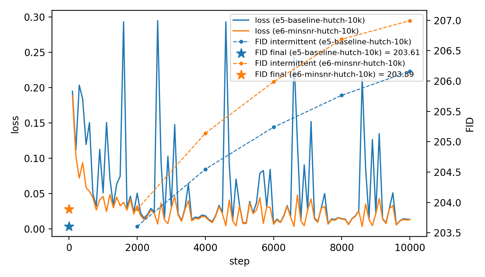
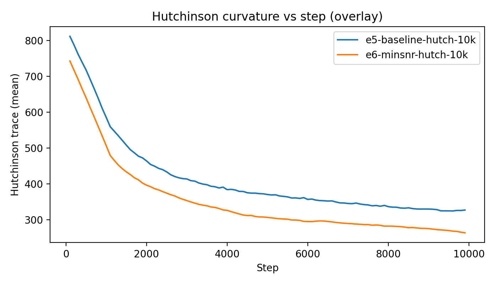
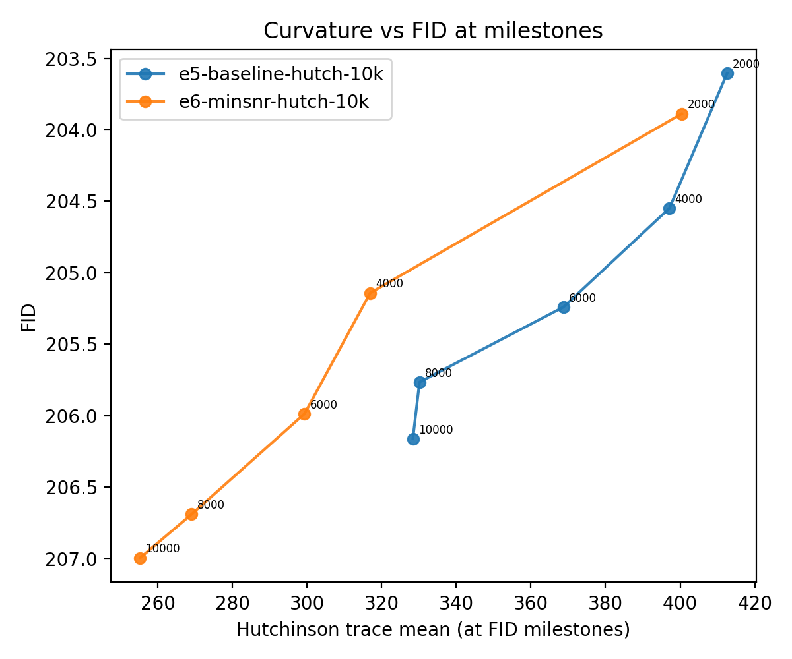
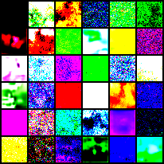

# W1-E6 – Min-SNR Hutchinson trace probe (linear β, 10k, 50 NFE)

## TL;DR

- W1-E6 swaps the loss from constant ε-MSE (E5) to Min-SNR-weighted ε-MSE with everything else held fixed.
- **Curvature reacts strongly; FID does not.**
  - The Min-SNR run (E6) has a consistently lower Hutchinson trace than the baseline E5 over the whole 0–10k trajectory (Fig. 2).
  - The curvature-vs-FID curve for E6 is shifted leftwards relative to E5 (Fig. 3): for similar bad FIDs, Min-SNR sits in a flatter basin.
- **Sample quality stays garbage.**
  - Both runs live in the **FID ≈ 203–207** band.
  - FID is best early (around the first milestone) and drifts slightly worse with more steps (Fig. 1).
- Takeaway: Min-SNR clearly changes the local geometry of training on this tiny CIFAR-10 DDPM, but at 10k steps / 32×32 it doesn’t yet buy better samples.  
  Hutchinson looks like a sensitive diagnostic, not a “quality oracle,” at this scale.

---

## Setup

- **Baseline (W1-E5):**  
  `configs/study/MS1_min_snr/e5/e5_baseline_linear_hutch_trace_10k_50nfe.yaml`  
  - Loss: `loss.weighting: "constant"`
- **Variant (W1-E6):**  
  `configs/study/MS1_min_snr/e6/e6_minsnr_linear_hutch_trace_10k_50nfe.yaml`  
  - Loss: `loss.weighting: "minsnr"`

Shared config:

- **Dataset:** CIFAR-10
- **Model:** `unet_cifar32` (same as W1-E1/E2)
- **Diffusion:** β-schedule `linear`, T = 1000
- **Optim:** Adam, lr 1e-4, grad clip 1.0, AMP on
- **Train steps:** 10k
- **EMA:** enabled, decay 0.999
- **Eval:**
  - Milestone FID: DDPM, NFE=50, 5k samples every 2k steps
  - Final FID: DDPM, NFE=50, 10k samples at end
- **Curvature probe:**
  - Hutchinson trace w/ 16 Rademacher probes
  - Logged as `curvature/hutch_trace_mean` and `curvature/hutch_trace_std`

---

## Key plots

### Fig. 1 – Loss + FID vs step (E5 vs E6)

- Solid lines: `train/loss` for E5 (constant) and E6 (Min-SNR).
- Dashed lines + markers: milestone `val/fid` every 2k steps.
- Stars: “final” FID for each run.

Observations:

- **Loss:**
  - E5’s loss is **noisy and spiky**, with frequent tall spikes early.
  - E6’s loss is **smoother and generally lower**, especially after ~2k steps.
- **FID:**
  - Both runs achieve their *best FIDs early* (around the first milestone) and then creep upward with more training.
  - The E5 and E6 FID curves are almost on top of each other; differences are well within ~O(1) FID.
  - Final FIDs are essentially tied in the low-200s.

Story from this plot: *Min-SNR clearly changes the loss landscape the optimizer sees (smoother/less spiky loss), but the sampling quality curve vs step is almost unchanged at this scale.*

---

### Fig. 2 – Hutchinson curvature vs step (overlay)

- X: `step`
- Y: `curvature/hutch_trace_mean` (smoothed)

Observations:

- Both runs show the same overall:
  - Large curvature early.
  - Rapid drop over the first ~2k steps.
  - Shallow tail / slow decay from there to 10k.
- The **Min-SNR curve (E6) is strictly below E5** across the whole training window.
  - Early steps: noticeably lower curvature than E5.
  - Late steps (8k–10k): E6 remains **~10–20%** flatter than E5.

So, in terms of Hessian trace proxy, Min-SNR behaves like a geometry flattening trick: same optimization trajectory, but in a gentler landscape.

---

### Fig. 3 – Curvature vs FID at milestones

File:  

- Each run contributes 5 points (milestones at 2k,4k,6k,8k,10k).
- X: `curvature/hutch_trace_mean` at those steps.
- Y: `val/fid` at those steps (lower is better; the plot inverts the axis so “down” is good).

Observations:

- Both runs trace a monotone curve: as training proceeds,
  - **Curvature ↓**, but
  - **FID ↑** (worse).
- The E6 curve is shifted left of E5:
  - For any given FID band, Min-SNR sits at a lower curvature than the baseline.
  - But the *direction* of the curve (toward worse FID) is the same.

Interpretation: Min-SNR moves you into flatter regions of parameter space, but in this tiny-model regime *those regions correspond to the same bad FID plateau*.

---

### Fig. 4 – Sample grid

File (example):  

- Extremely saturated colour blocks and speckle.
- No recognisable CIFAR-10 structure in either run.
- Fits the FID ≈ 200+ story: undertrained + underpowered, far from reasonable generative quality.

---

## Numbers (E5 baseline, with E6 as a relative)

Here are concrete stats for **E5** from its `loss.jsonl` and `results.jsonl`. E6 is described in relative terms from the overlays.

### Training dynamics (E5)

From the E5 `loss.jsonl`:

- **Train loss (`train/loss`):**
  - First logged (step 100): **0.195**
  - Last (step 10k): **0.0135**
  - Early window 100–2k → mean ≈ **0.102**
  - Late window 8k–10k → mean ≈ **0.041**
  - Approx **60% drop** in mean loss (early → late).

- **Grad global L2 (`train/grad_global_L2`):**
  - Early window 100–2k → mean ≈ **0.207**
  - Late window 8k–10k → mean ≈ **0.122**
  - Approx **41% drop**.

- **Curvature (Hutchinson trace mean):**
  - Step 100: **≈ 1009**
  - Step 10k: **≈ 328**
  - Early window 100–2k → mean ≈ **591**
  - Late window 8k–10k → mean ≈ **330**
  - Approx **44% drop** in curvature.

So, even for the vanilla loss, the optimizer makes the usual “everything shrinks” progress: loss, gradients, and curvature all decrease substantially over 10k steps.

### FID milestones (E5)

From E5 `loss.jsonl` and `results.jsonl`:

| Step | FID (DDPM, NFE=50, 5k samples) |
|------|--------------------------------|
| 2k   | **203.61**                     |
| 4k   | 204.55                         |
| 6k   | 205.24                         |
| 8k   | 205.77                         |
| 10k  | 206.16                         |

- **Best recorded FID:** ≈ **203.61** (first milestone / best-of-run).

### Relative behaviour (E6 vs E5)

From the three overlays:

- **Loss (Fig. 1):**
  - E6’s loss curve is smoother and slightly lower than E5’s across most of training.
  - No evidence of new instabilities; if anything, Min-SNR stabilises the updates.

- **Curvature (Fig. 2):**
  - E6’s curvature is lower at all steps; roughly a 10–30% reduction across training.
  - The overall shape is unchanged: sharp fall then long tail.

- **FID (Fig. 1 & Fig. 3):**
  - E6’s milestone FIDs track E5’s closely, staying in the same 203–207 range, and generally **do not outperform E5 by more than ~O(1) FID** at any step.
  - The curvature-vs-FID curve is shifted left (flatter for same FID), but not downwards (no FID gain).

---

## Interpretation

- **The Hutchinson probe works.**  
  We get a clean, interpretable curvature signal that responds to the Min-SNR change in exactly the way theory suggests: Min-SNR pushes training into flatter regions.

- **But curvature change ≠ quality change (here).**  
  In this very small-compute regime, FID appears dominated by capacity / undertraining / schedule rather than by local geometry tweaks. Both E5 and E6 end up in “flat but bad” basins.

- **Min-SNR behaves more like a “geometry regulariser” than a magic bullet.**  
  It makes the loss/curvature story nicer, but does **not** rescue a severely underpowered model.

This is still a useful result: it tells that good curvature is necessary but not sufficient for good FID, at least at 10k steps batch 4 on 32×32 CIFAR-10.

---

## Next steps suggested by E6

Concrete follow-ons that build directly on this pair perhaps:

1. **Scale up the same measurement.**
   - Repeat E5/E6 at **50k steps** (or with a slightly bigger U-Net) while keeping the Hutchinson probe.
   - Question: *does Min-SNR start to matter once the model is capable of leaving the FID≈200 swamp?*

2. **Change β schedule, keep curvature.**
   - Run the same E5/E6 pair under a **cosine** β schedule with Hutchinson enabled.
   - Look for interactions:
     - Does cosine + Min-SNR give a different curvature-vs-FID curve than linear + Min-SNR?

3. **Standardise Hutchinson in the harness.**
   - Treat this probe as a **first-class diagnostic**:
     - Run it on baselines whenever you try a new loss/schedule.
     - Over time, build a small library of “curvature vs FID” plots across different settings.

For W1-E6 itself, the conclusion:

> **Min-SNR definitely reshapes the local curvature of training, but in this tiny CIFAR-10 DDPM it doesn’t yet buy better FID.**  
> The Hutchinson probe is validated; the model isn’t.
> Will get there eventually.