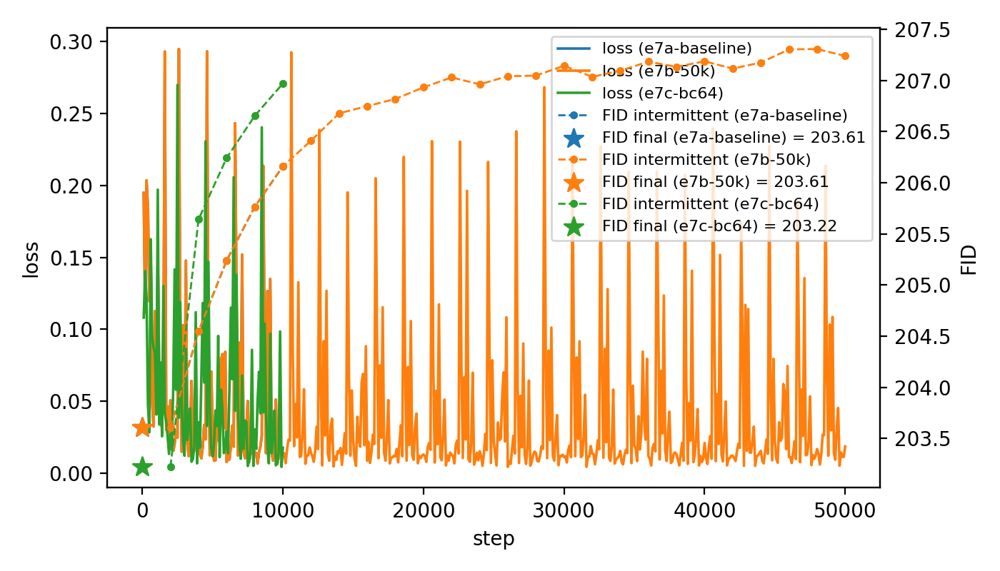
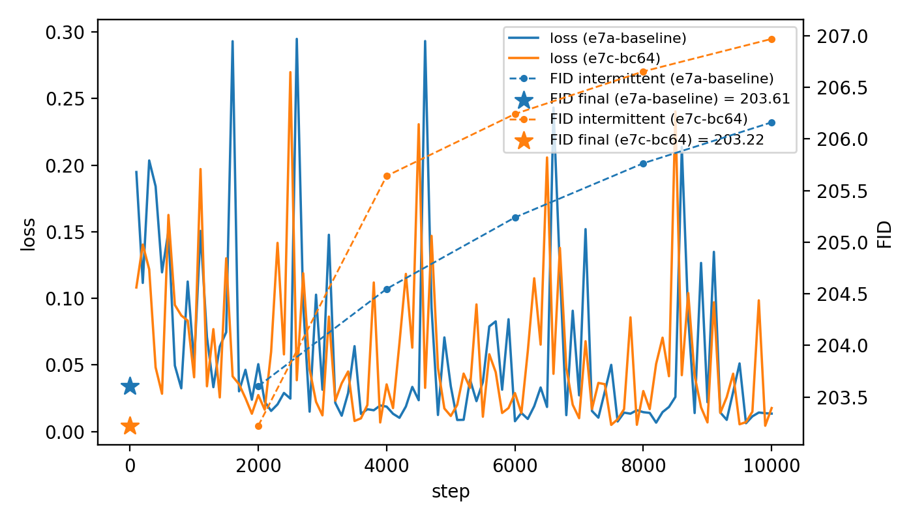
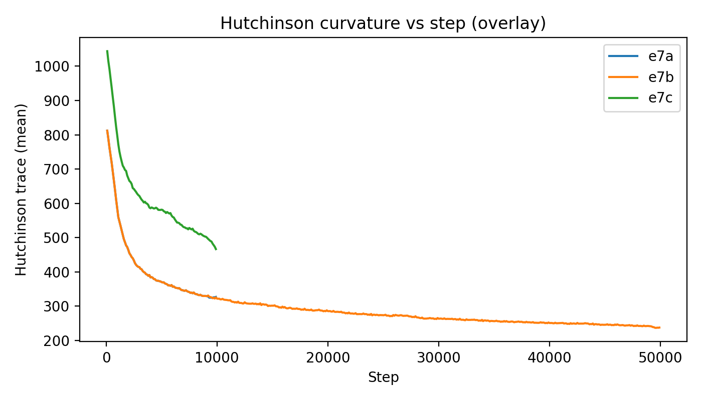
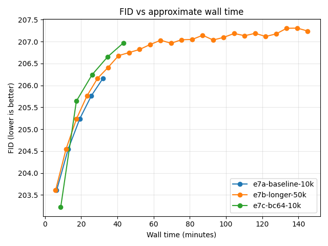
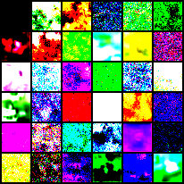
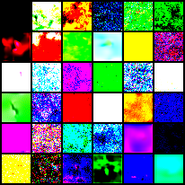
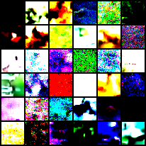

# E7 – Longer training & higher capacity under linear β

## Question

Does more training (10k → 50k steps) or higher capacity (base_channels 32 → 64) improve FID for the baseline linear-β DDPM?

---

## Experiments

| ID  | Name                      | Config path                                                      |
|-----|---------------------------|------------------------------------------------------------------|
| e7a | Baseline, 10k steps       | `configs/study/MS1_min_snr/e7/e7a_baseline_linear_10k.yaml`     |
| e7b | Baseline, 50k steps       | `configs/study/MS1_min_snr/e7/e7b_baseline_linear_50k.yaml`     |
| e7c | Baseline, 10k, bc64       | `configs/study/MS1_min_snr/e7/e7c_baseline_linear_10k_bc64.yaml`|

Common settings:

- Dataset: CIFAR-10 (32×32), batch size 4
- Linear β schedule, vanilla DDPM loss
- UNet_CIFAR32 backbone
- Evaluation: FID every 2k steps, 50-NFE DDPM sampler
- Hutchinson curvature probe logged during training

---

## Headline result

All three runs land in the **same bad FID band (~203–207)**, and:

> **Extra training consistently hurts FID, even while loss and curvature improve.**

- e7a (10k, bc32): best FID ≈ **203.6**
- e7b (50k, bc32): best FID ≈ **203.6** (no gain vs 10k)
- e7c (10k, bc64): best FID ≈ **203.2** (tiny improvement)

---

## Loss & FID vs step

**Figure 1 – Loss + FID vs step**  

- Training loss:
  - Noisy but trending downward across all runs.
- FID:
  - Best FID appears at the first evaluation (~2k steps).
  - After 2k, FID steadily worsens as training continues (10k and 50k).

**Figure 2 – Loss + FID vs step (zoom, e7a vs e7c, 0–10k)**  

- e7a (bc32) and e7c (bc64) track similar loss trajectories.
- FID:
  - Both runs have **minimum FID at ~2k steps**.
  - Beyond that, more steps → worse FID, even though loss keeps decreasing.

**Takeaway.** Under this baseline setup, train longer is actively bad for FID. Loss is not a reliable proxy for sample quality here at all.

---

## Curvature (Hutchinson trace) vs step

**Figure 3 – Hutchinson curvature vs step**  

- Early steps:
  - e7c (bc64) starts at much higher curvature (~1250 at 100 steps).
  - e7a/b (bc32) start lower (~800).
- As training proceeds:
  - Curvature **monotonically decays** for all runs.
  - By 10k steps, e7a and e7c both sit in a similar low band (~300–450), e7c remains higher.
- For e7c specifically, at FID checkpoints:
  - 2k: curvature ≈ 650, FID ≈ **203.2** (best)
  - 10k: curvature ≈ 460, FID ≈ **207+** (worse)

**Takeaway.**

- **Higher capacity → higher curvature early**, training rapidly flattens the landscape.
- There is a **negative curvature–FID correlation**: as curvature decreases, FID gets worse. Very persistent in this setup.
- Pushing the optimizer to flatten the curvature appears to move the model toward *worse* generative behaviour, which is interesting.

---

## FID vs approximate wall time

**Figure 4 – FID vs approximate wall time**  

- All three curves show monotonic degradation:
  - The best FID for each run occurs within the first ~10–20 minutes.
  - Extra wall time (more steps) pushes FID upward into ~207.
- e7b (50k steps) spends ~2×–3× more wall time than the 10k runs, for no FID gain vs e7a and slightly worse late-training FID. e7c's runtime is ~1.2x longer.

**Takeaway.** As was known: under this training objective/schedule, compute beyond the first checkpoint has negative return for FID, AND longer training/more capacity does not resolve it in of itself.

---

## Sample grids

**Figure 5 – Sample grids at final checkpoint**

- e7a grid: 

- e7b grid: 

- e7c grid: 

Qualitative observations:

- All three runs produce highly saturated, posterized images with speckle.
- Some large-scale structure appears (patches of colour, hints of shapes), but:
  - Images are still far from “CIFAR-like.”
  - The grids for e7b (50k) do **not** look qualitatively better than e7a/e7c.
  - Grids from e7c are significantly different from e7ab (and other experiements thus far). Early qualitivly, they look more nuanced and less flat.

**Takeaway.** Visual samples match the FID story: models never leave flat noise regime during these runs. Might investigate e7c further.

---

## Capacity vs best FID

Comparing e7a (bc32) vs e7c (bc64):

- **Curvature:**
  - e7c starts and ends with significantly higher curvature, consistent with more parameters.
- **FID:**
  - e7c’s best checkpoint is marginally better (~203.2 vs 203.6).
  - The improvement is very small relative to overall FID scale and well within still bad territory (might just be noise).

**Takeaway.** Doubling base_channels in this regime gives only a tiny FID gain, and does not change the core failure mode (early best FID, degradation with more training). Effects are interesting and different but not nessicarly better.

---

## Interpretation & implications

1. **Loss–FID mismatch.**  
   The DDPM MSE loss continues to improve while FID and samples degrade. Optimizing the loss naively pushes the model away from the early “sweet spot” for sample quality.

2. **Landscape flattening ≠ better samples.**  
   Hutchinson curvature decays smoothly as training progresses, but lower curvature correlates with *worse* FID. Simply flattening the landscape is not sufficient and may even be outright harmful in this setup.

3. **Training longer does not help this baseline.**  
   50k steps (e7b) does not beat 10k (e7a) in best FID, and its late-training checkpoints are strictly worse.

4. **Capacity is interesting but not strongly so.**  
   Increasing base_channels from 32 → 64 only slightly improves best FID, with qualitatively different but still noisy samples. Main issue is perhaps **objective / weighting / schedule**, not raw capacity (or runtime).

---

## What E7 results:

E7 is a clean clear **negative result** which again shows the monotonic fid curve increase in these experiements:

- Under a linear β schedule with vanilla DDPM loss:
  - More steps and more compute are actually entirely counter-productive for FID, this has been demonstraighted many times in this config.
  - The model flattens its loss landscape while perhaps over-fitting a bad objective OR sevearly underfitting (@ batch size 4) to the point of non-conclusive results.
- Maybe:
  - Exploring **Min-SNR loss reweighting** (γ sweeps) to prevent the model from over-emphasizing late-time, low-SNR regions.
  - Considering **early-stopping baselines** (e.g., 2k-step checkpoint as a surprisingly strong baseline for these).
  - Investigating more diagnostics that link **per-t loss / SNR / curvature** to FID.

**So:**  
> E7 shows that, for this baseline linear-β DDPM, “just train longer or bigger” does not fix FID and does not improve samples whatsoever! A smarter loss/weighting strategy, or further testing for those capacity effects might fix this, so the upcoming Min-SNR experiments (E8+) aim to test this.
