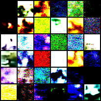
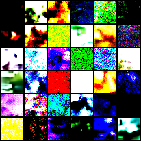
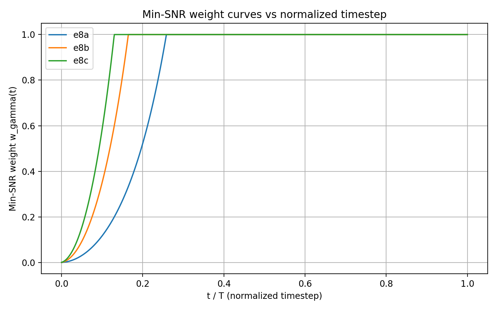
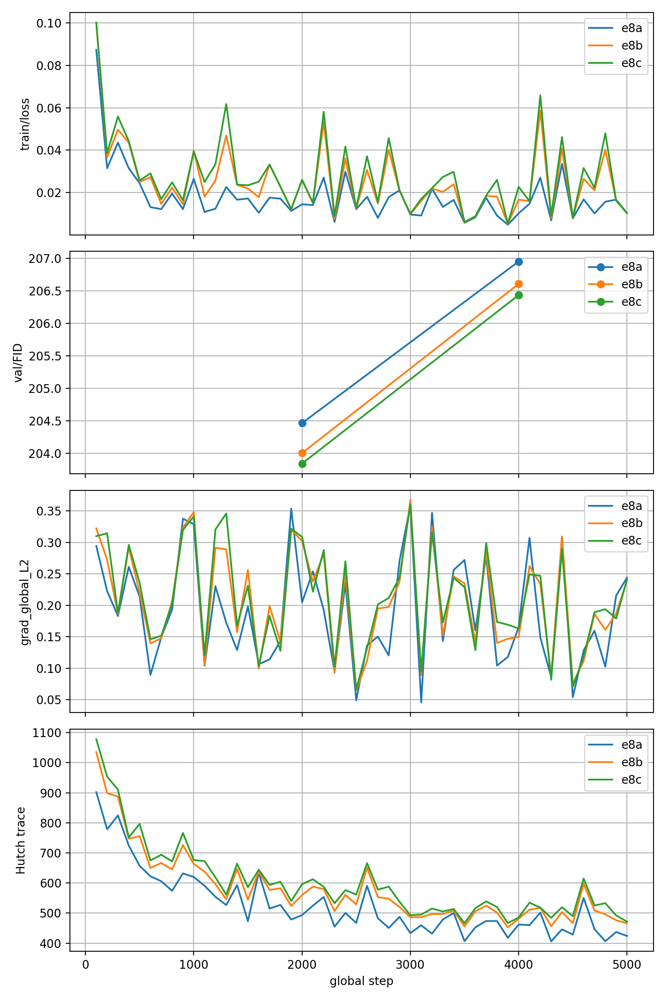
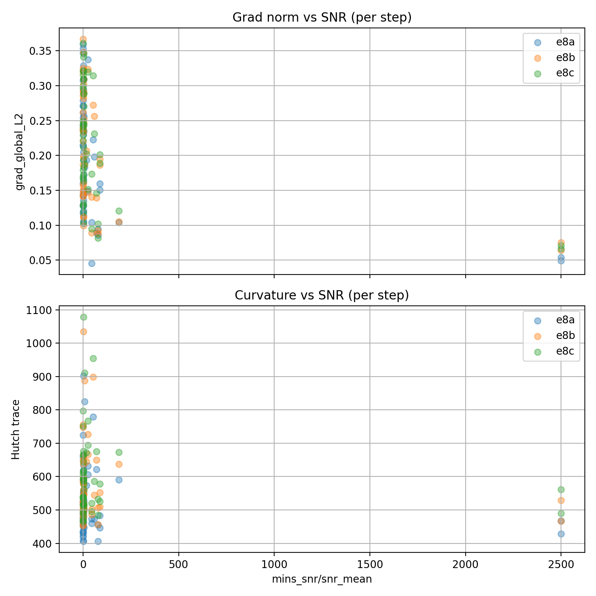

# E8 – Min-SNR γ sweep (mini, 5k, bc64)

**ID:** E8  
**Study:** MS1_min_snr  
**Goal:** Pick a “good enough” Min-SNR γ ∈ {1, 3, 5} for later full 50k runs, using tiny 5k pilots with `base_channels=64`.

**Configs:**
- **E8a (γ=1):** `configs/study/MS1_min_snr/e8/e8a_minsnr_linear_gamma1_5k_bc64.yaml`
- **E8b (γ=3):** `configs/study/MS1_min_snr/e8/e8b_minsnr_linear_gamma3_5k_bc64.yaml`
- **E8c (γ=5):** `configs/study/MS1_min_snr/e8/e8c_minsnr_linear_gamma5_5k_bc64.yaml`

---

## Design (short)

- **Data:** CIFAR-10, `batch_size=4`, standard split, shuffle.
- **Model:** `unet_cifar32`, `base_channels=64`, defaults otherwise.
- **Diffusion:** DDPM, `beta_schedule="linear"`.
- **Loss:** ε-MSE with Min-SNR.
  - E8a: `gamma=1.0`
  - E8b: `gamma=3.0`
  - E8c: `gamma=5.0`
- **Optim:** Adam, `lr=1e-4`, `grad_clip=1.0`, `amp=true`.
- **Train:** `total_steps=5000`, `seed=1077`, EMA `decay=0.999`.
- **Eval (planned):**
  - FID milestones: every 2000 steps, `ddpm`, `nfe=50`, `n_samples=5000`.
  - Final FID @5k: `ddim`, `nfe=50`, `n_samples=10000`.
  - Grid: @5k, `ddim`, `nfe=20`, `n_samples=36`, save images.
- **Curvature:** Hutchinson enabled (diagnostic only).

---

## Primary metric & comparison

- **Main metric:** validation FID vs step (EMA model).
- For each γ, record:
  - `FID_2k`, `FID_4k`, `FID_5k`
  - `FID_min(0–5k)` (min FID over run)

---

## Scope / caveats

- Single seed, 5k steps → **pilot only**, not a final comparison vs baselines.
- Only used to choose a candidate γ; small FID gaps (<5–10%) are treated as noise.
- In this pilot, the *logged* FID points visible in plots are at **2k** and **4k** (and the best FID tends to occur early).

---

## Artifacts (plots)

Saved under `docs/assets/e8/e8_plots/`:

- `e8_step_curves.png`  
  Train loss, FID milestones, grad norm, Hutch trace vs step (overlay: a/b/c).
- `e8_weight_curves.png`  
  Min-SNR weight curve `w_γ(t)` vs normalized timestep.
- `effective_loss_vs_t.png`  
  Unweighted per-t `MSE(t)` and effective contribution `w_γ(t) * MSE(t)`.
- `e8_snr_geometry.png`  
  Per-step grad norm + curvature vs per-step mean SNR (scatter).
- `grid.png`  
  Sample grid at 5k (DDIM, NFE=20).

---

## Results

### FID milestones (EMA)

| Run | γ | FID @ 2k | FID @ 4k | Best FID in run | Notes |
|-----|---:|---------:|---------:|----------------:|------|
| E8a | 1  | 204.47 | 206.95 | 204.47 | Best occurs early (2k). |
| E8b | 3  | 204.0 | ~206.6 | 204.0 |  |
| E8c | 5  | 203.9 | ~206.5 | 203.9 |  |

**Observed ordering:** γ=5 best, then γ=3, then γ=1 (at both 2k and 4k).  
**But:** all three runs *worsen* from 2k → 4k in these milestone evaluations.

### Qualitative samples (@5k)
The 5k grids are visually indistinguishable. 
This matches the extremely high FID regime: early-stage differences are too small to see.

#### e8a Samples:

#### e8c Samples:

---

## What changed (model interpretation / mechanism)

### 1) γ mostly changes the *time budget* of the objective

- **Higher γ reaches weight=1 sooner** (it downweights fewer early high-SNR timesteps).
  - γ=1 reaches `w=1` around **t/T ≈ 0.26**
  - γ=3 around **t/T ≈ 0.16**
  - γ=5 around **t/T ≈ 0.12**

Interpretation: γ controls how aggressively Min-SNR suppresses extremely clean (high-SNR) timesteps.

### Raw per-t difficulty is similar; the effective objective seems different

- **Unweighted per-t MSE(t)** curves are nearly identical across γ → at 5k steps, the model’s per-t denoising error profile hasn’t meaningfully diverged.
- **Effective contribution `w_γ(t) * MSE(t)`** differs strongly:
  - γ=1 suppresses early-t contributions the most.
  - γ=3/5 allocate noticeably more loss mass to early timesteps (roughly `t/T < ~0.2`).

### Optimization geometry shifts mildly but remains stable

- **Grad norms** remain bounded and broadly similar across γ (no instability).
- **Hutchinson trace** is slightly higher for larger γ early on (e8c tends to sit above e8a), consistent with more early-t emphasis ⇒ slightly stronger updates / curvature, but no blow-ups.
- Rare batches with very high mean SNR (outliers) appear (batch=4 sampling), yet they do not produce extreme gradient/curvature spikes → consistent with Min-SNR.

### Train loss decreases don’t track FID ordering here
Train loss is lowest for γ=1 and highest for γ=5 (in the overlay), yet FID ranks in the opposite direction.  
This is expected: **weighted objectives can change the relationship between "train loss" and sample quality**, especially this early.

---

## Decision

**Carry forward:** **γ = 5** (E8c) as the candidate for the next longer runs.  
Rationale: it is consistently best on FID at both recorded milestones, and it shows no optimization pathology in grad/curvature diagnostics.

