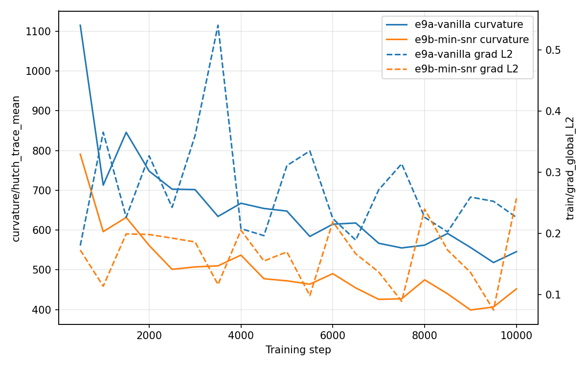
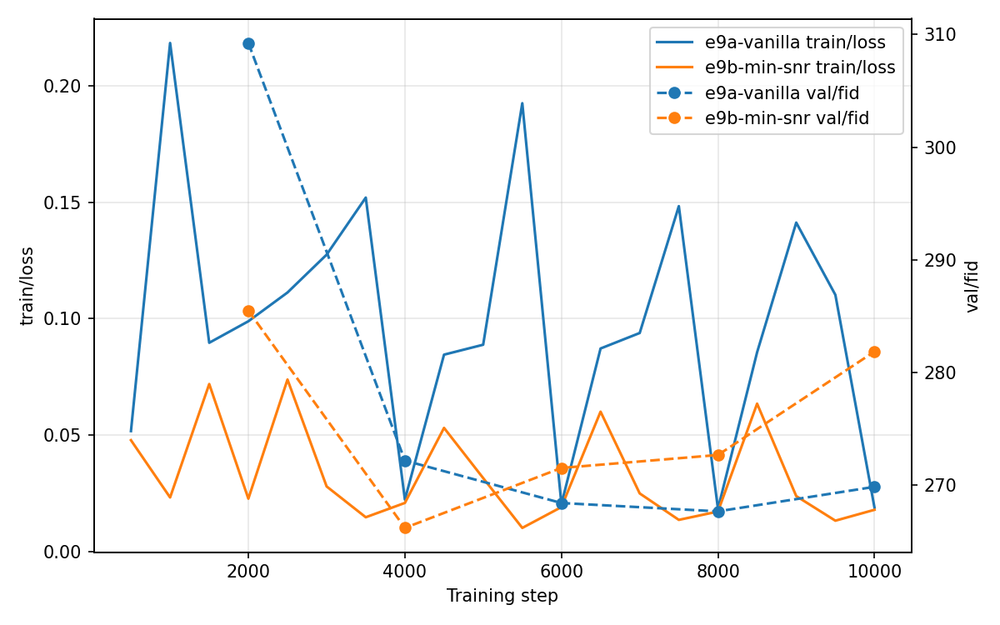
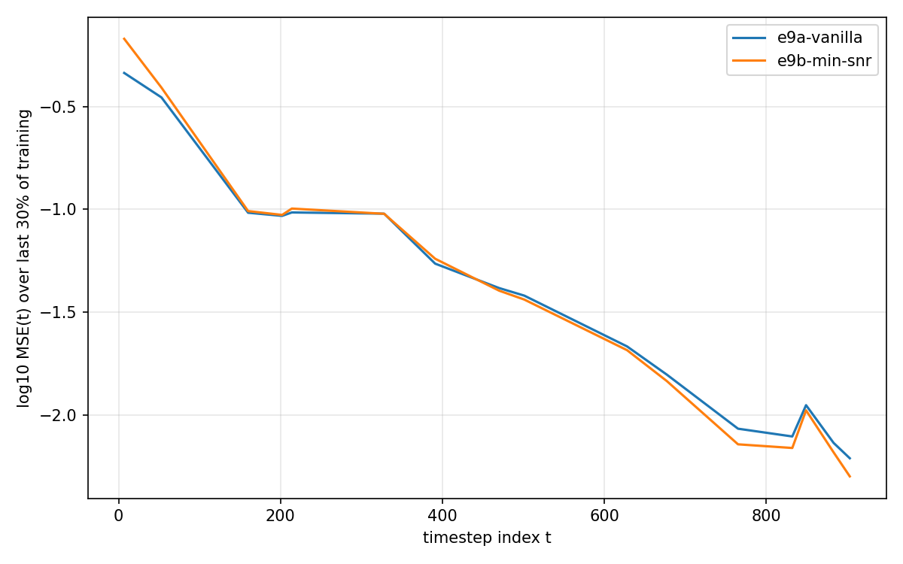
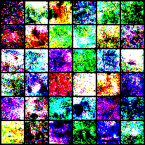
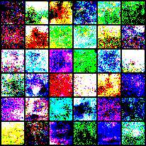

# MS1 – E9 Results: Scheduler interaction (cosine × Min-SNR)

**ID:** E9  
**Study:** MS1_min_snr  
**Goal:** Pathology check — does Min-SNR (γ=5) behave sanely under a cosine β schedule vs vanilla ε-MSE?  
**Seed:** 1077 (paired) • **Steps:** 10k • **Model:** unet_cifar32 (bc64) • **β schedule:** cosine

## Runs
- **e9a (vanilla + cosine):** `configs/study/MS1_min_snr/e9/e9a_baseline_cosine_10k.yaml`
- **e9b (Min-SNR γ=5 + cosine):** `configs/study/MS1_min_snr/e9/e9b_minsnr_cosine_gamma5_10k.yaml`

## Plots

- 

- 

- 

## Summary
- **H1 (sanity): PASS.** Min-SNR under cosine trains to 10k without divergence/NaNs. Curvature does not blow up.
- **H2 (soft similar or better than vanilla): MIXED.** FID stays in the same rough band as vanilla, but Min-SNR’s FID improves early then drifts worse late, while vanilla improves longer and only slightly worsens near the end.

## Key observations
- **Curvature + grad L2:** e9b shows consistently lower Hutchinson trace curvature and generally lower grad-L2 than e9a →  so looks tamer, not unstable.
- **FID trajectory:** e9b's late degradation suggests γ=5 may be **too aggressive under cosine**, even if early training looks fine.
- **Per-timestep MSE profile:** e9b is slightly worse at very low t (high-SNR / near-clean) and slightly better at high t (low-SNR / very noisy) — consistent with Min-SNR shifting capacity away from early timesteps.

## Samples:

- Grid e9a:

- Grid e9b:

Overall very similar, and cosine makes them noisy.

## Takeaway
Cosine × Min-SNR is safe to run. With γ=5 it may trade away low-t quality enough to hurt late FID. Next levers: try smaller γ on cosine (1 or 3) or a uniform→Min-SNR switch/warmup, plus sampling sanity (DDPM vs DDIM) to ensure reweighting isn’t masking sampling issues.

